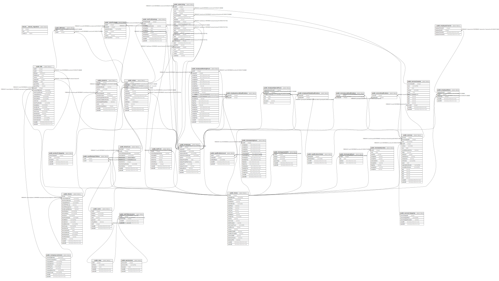

# superdbdocker

## Tables

| Name | Columns | Comment | Type |
| ---- | ------- | ------- | ---- |
| [drizzle.__drizzle_migrations](drizzle.__drizzle_migrations.md) | 3 |  | BASE TABLE |
| [public.billOrders](public.billOrders.md) | 2 |  | BASE TABLE |
| [public.bills](public.bills.md) | 27 |  | BASE TABLE |
| [public.companycustomers](public.companycustomers.md) | 10 |  | BASE TABLE |
| [public.driverCars](public.driverCars.md) | 11 |  | BASE TABLE |
| [public.drivers](public.drivers.md) | 23 |  | BASE TABLE |
| [public.employeeGlobalQualifications](public.employeeGlobalQualifications.md) | 2 |  | BASE TABLE |
| [public.employeeLocalQualifications](public.employeeLocalQualifications.md) | 2 |  | BASE TABLE |
| [public.employeeSpecialHours](public.employeeSpecialHours.md) | 7 |  | BASE TABLE |
| [public.employeeStore](public.employeeStore.md) | 4 |  | BASE TABLE |
| [public.employeeWorkingHours](public.employeeWorkingHours.md) | 25 |  | BASE TABLE |
| [public.employees](public.employees.md) | 13 |  | BASE TABLE |
| [public.orderListing](public.orderListing.md) | 24 |  | BASE TABLE |
| [public.orders](public.orders.md) | 14 |  | BASE TABLE |
| [public.permissions](public.permissions.md) | 5 |  | BASE TABLE |
| [public.productCategories](public.productCategories.md) | 5 |  | BASE TABLE |
| [public.products](public.products.md) | 14 |  | BASE TABLE |
| [public.qualificationsGlobal](public.qualificationsGlobal.md) | 4 |  | BASE TABLE |
| [public.qualificationsLocal](public.qualificationsLocal.md) | 5 |  | BASE TABLE |
| [public.rentCarBookings](public.rentCarBookings.md) | 10 |  | BASE TABLE |
| [public.rentCars](public.rentCars.md) | 9 |  | BASE TABLE |
| [public.roleToPermissions](public.roleToPermissions.md) | 4 |  | BASE TABLE |
| [public.roles](public.roles.md) | 5 |  | BASE TABLE |
| [public.serviceCategories](public.serviceCategories.md) | 5 |  | BASE TABLE |
| [public.serviceLocalQualifications](public.serviceLocalQualifications.md) | 2 |  | BASE TABLE |
| [public.serviceQualifications](public.serviceQualifications.md) | 2 |  | BASE TABLE |
| [public.serviceVariants](public.serviceVariants.md) | 13 |  | BASE TABLE |
| [public.services](public.services.md) | 22 |  | BASE TABLE |
| [public.storeopeninghours](public.storeopeninghours.md) | 17 |  | BASE TABLE |
| [public.storepaymentinfo](public.storepaymentinfo.md) | 6 |  | BASE TABLE |
| [public.stores](public.stores.md) | 24 |  | BASE TABLE |
| [public.storespecialhours](public.storespecialhours.md) | 4 |  | BASE TABLE |
| [public.storeweeklynotes](public.storeweeklynotes.md) | 10 |  | BASE TABLE |
| [public.userBelongsToStore](public.userBelongsToStore.md) | 2 |  | BASE TABLE |
| [public.users](public.users.md) | 9 |  | BASE TABLE |
| [public.orderProducts](public.orderProducts.md) | 7 |  | BASE TABLE |

## Relations

---

> Generated by [tbls](https://github.com/k1LoW/tbls)
