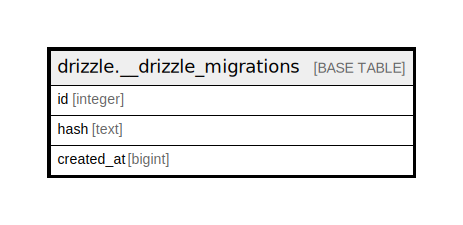

# drizzle.__drizzle_migrations

## Description

## Columns

| Name | Type | Default | Nullable | Children | Parents | Comment |
| ---- | ---- | ------- | -------- | -------- | ------- | ------- |
| id | integer | nextval('drizzle.__drizzle_migrations_id_seq'::regclass) | false |  |  |  |
| hash | text |  | false |  |  |  |
| created_at | bigint |  | true |  |  |  |

## Constraints

| Name | Type | Definition |
| ---- | ---- | ---------- |
| __drizzle_migrations_pkey | PRIMARY KEY | PRIMARY KEY (id) |

## Indexes

| Name | Definition |
| ---- | ---------- |
| __drizzle_migrations_pkey | CREATE UNIQUE INDEX __drizzle_migrations_pkey ON drizzle.__drizzle_migrations USING btree (id) |

## Relations

---

> Generated by [tbls](https://github.com/k1LoW/tbls)
