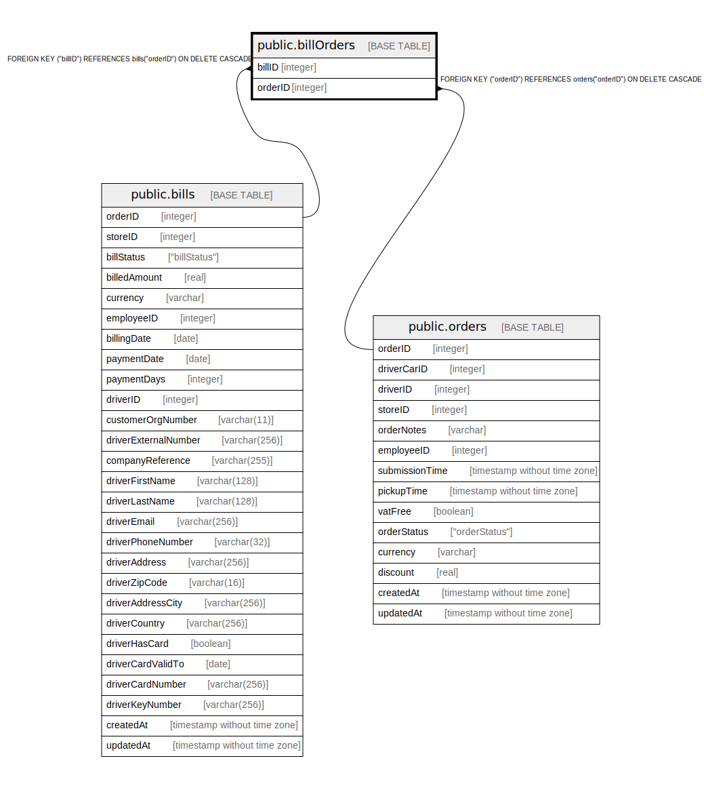

# public.billOrders

## Description

## Columns

| Name | Type | Default | Nullable | Children | Parents | Comment |
| ---- | ---- | ------- | -------- | -------- | ------- | ------- |
| billID | integer |  | false |  | [public.bills](public.bills.md) |  |
| orderID | integer |  | false |  | [public.orders](public.orders.md) |  |

## Constraints

| Name | Type | Definition |
| ---- | ---- | ---------- |
| billOrders_orderID_orders_orderID_fk | FOREIGN KEY | FOREIGN KEY ("orderID") REFERENCES orders("orderID") ON DELETE SET NULL |
| billOrders_billID_orderID_pk | PRIMARY KEY | PRIMARY KEY ("billID", "orderID") |
| billOrders_billID_bills_orderID_fk | FOREIGN KEY | FOREIGN KEY ("billID") REFERENCES bills("orderID") ON DELETE SET NULL |

## Indexes

| Name | Definition |
| ---- | ---------- |
| billOrders_billID_orderID_pk | CREATE UNIQUE INDEX "billOrders_billID_orderID_pk" ON public."billOrders" USING btree ("billID", "orderID") |

## Relations

---

> Generated by [tbls](https://github.com/k1LoW/tbls)
