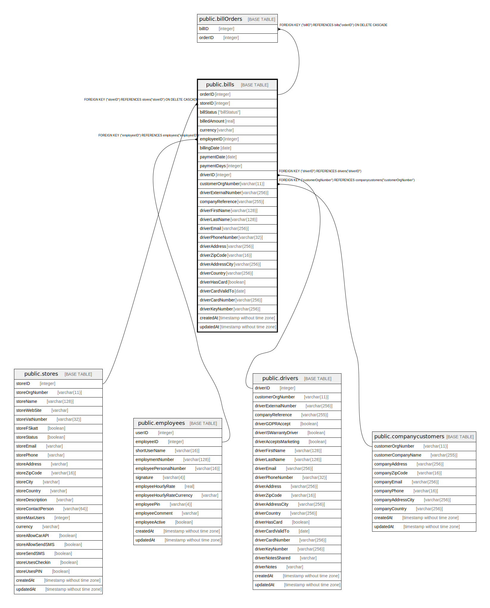

# public.bills

## Description

## Columns

| Name | Type | Default | Nullable | Children | Parents | Comment |
| ---- | ---- | ------- | -------- | -------- | ------- | ------- |
| orderID | integer | nextval('"bills_orderID_seq"'::regclass) | false | [public.billOrders](public.billOrders.md) |  |  |
| billStatus | "billStatus" |  | false |  |  |  |
| employeeID | integer |  | true |  | [public.employees](public.employees.md) |  |
| billingDate | date |  | false |  |  |  |
| paymentDate | date |  | false |  |  |  |
| paymentDays | integer |  | false |  |  |  |
| driverID | integer |  | false |  | [public.drivers](public.drivers.md) |  |
| customerOrgNumber | varchar(11) |  | true |  | [public.companycustomers](public.companycustomers.md) |  |
| driverExternalNumber | varchar(256) |  | true |  |  |  |
| companyReference | varchar(255) |  | true |  |  |  |
| driverFirstName | varchar(128) |  | false |  |  |  |
| driverLastName | varchar(128) |  | false |  |  |  |
| driverEmail | varchar(256) |  | false |  |  |  |
| driverPhoneNumber | varchar(32) |  | false |  |  |  |
| driverAddress | varchar(256) |  | false |  |  |  |
| driverZipCode | varchar(16) |  | false |  |  |  |
| driverAddressCity | varchar(256) |  | false |  |  |  |
| driverCountry | varchar(256) |  | false |  |  |  |
| driverHasCard | boolean | false | true |  |  |  |
| driverCardValidTo | date |  | true |  |  |  |
| driverCardNumber | varchar(256) |  | true |  |  |  |
| driverKeyNumber | varchar(256) |  | true |  |  |  |
| createdAt | timestamp without time zone | now() | false |  |  |  |
| updatedAt | timestamp without time zone | now() | false |  |  |  |
| storeID | integer |  | false |  | [public.stores](public.stores.md) |  |
| billedAmount | real |  | false |  |  |  |
| currency | varchar |  | false |  |  |  |

## Constraints

| Name | Type | Definition |
| ---- | ---- | ---------- |
| bills_pkey | PRIMARY KEY | PRIMARY KEY ("orderID") |
| bills_driverEmail_unique | UNIQUE | UNIQUE ("driverEmail") |
| bills_driverPhoneNumber_unique | UNIQUE | UNIQUE ("driverPhoneNumber") |
| bills_customerOrgNumber_companycustomers_customerOrgNumber_fk | FOREIGN KEY | FOREIGN KEY ("customerOrgNumber") REFERENCES companycustomers("customerOrgNumber") |
| bills_driverID_drivers_driverID_fk | FOREIGN KEY | FOREIGN KEY ("driverID") REFERENCES drivers("driverID") |
| bills_employeeID_employees_employeeID_fk | FOREIGN KEY | FOREIGN KEY ("employeeID") REFERENCES employees("employeeID") |
| bills_storeID_stores_storeID_fk | FOREIGN KEY | FOREIGN KEY ("storeID") REFERENCES stores("storeID") ON DELETE CASCADE |

## Indexes

| Name | Definition |
| ---- | ---------- |
| bills_pkey | CREATE UNIQUE INDEX bills_pkey ON public.bills USING btree ("orderID") |
| bills_driverEmail_unique | CREATE UNIQUE INDEX "bills_driverEmail_unique" ON public.bills USING btree ("driverEmail") |
| bills_driverPhoneNumber_unique | CREATE UNIQUE INDEX "bills_driverPhoneNumber_unique" ON public.bills USING btree ("driverPhoneNumber") |

## Relations

---

> Generated by [tbls](https://github.com/k1LoW/tbls)
