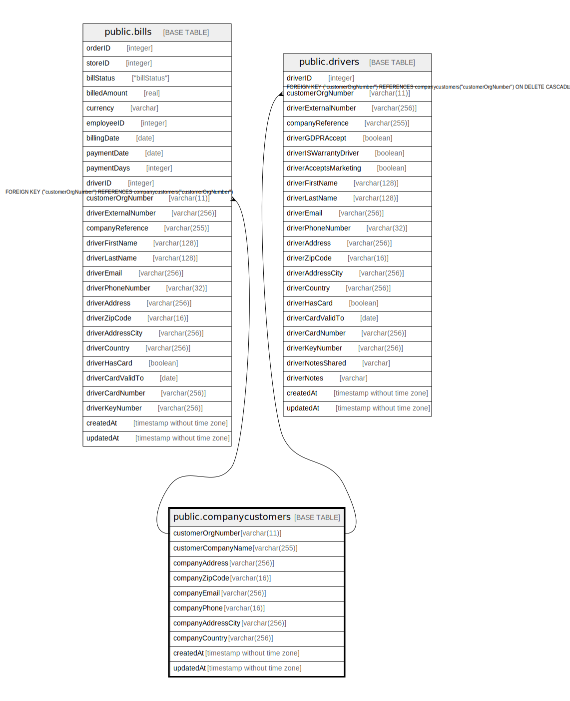

# public.companycustomers

## Description

## Columns

| Name | Type | Default | Nullable | Children | Parents | Comment |
| ---- | ---- | ------- | -------- | -------- | ------- | ------- |
| customerOrgNumber | varchar(11) |  | false | [public.drivers](public.drivers.md) [public.bills](public.bills.md) |  |  |
| customerCompanyName | varchar(255) |  | false |  |  |  |
| companyAddress | varchar(256) |  | false |  |  |  |
| companyZipCode | varchar(16) |  | false |  |  |  |
| companyEmail | varchar(256) |  | false |  |  |  |
| companyPhone | varchar(16) |  | false |  |  |  |
| companyAddressCity | varchar(256) |  | false |  |  |  |
| companyCountry | varchar(256) |  | false |  |  |  |
| createdAt | timestamp without time zone | now() | false |  |  |  |
| updatedAt | timestamp without time zone | now() | false |  |  |  |

## Constraints

| Name | Type | Definition |
| ---- | ---- | ---------- |
| companycustomers_pkey | PRIMARY KEY | PRIMARY KEY ("customerOrgNumber") |

## Indexes

| Name | Definition |
| ---- | ---------- |
| companycustomers_pkey | CREATE UNIQUE INDEX companycustomers_pkey ON public.companycustomers USING btree ("customerOrgNumber") |

## Relations

---

> Generated by [tbls](https://github.com/k1LoW/tbls)
