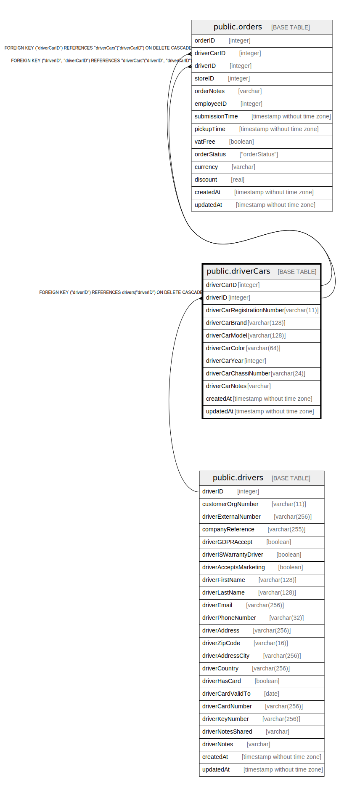

# public.driverCars

## Description

## Columns

| Name | Type | Default | Nullable | Children | Parents | Comment |
| ---- | ---- | ------- | -------- | -------- | ------- | ------- |
| driverCarID | integer | nextval('"driverCars_driverCarID_seq"'::regclass) | false | [public.orders](public.orders.md) |  |  |
| driverID | integer |  | true | [public.orders](public.orders.md) | [public.drivers](public.drivers.md) |  |
| driverCarRegistrationNumber | varchar(11) |  | false |  |  |  |
| driverCarBrand | varchar(128) |  | true |  |  |  |
| driverCarModel | varchar(128) |  | true |  |  |  |
| driverCarColor | varchar(64) |  | true |  |  |  |
| driverCarYear | integer |  | true |  |  |  |
| driverCarChassiNumber | varchar(24) |  | true |  |  |  |
| driverCarNotes | varchar |  | true |  |  |  |
| createdAt | timestamp without time zone | now() | false |  |  |  |
| updatedAt | timestamp without time zone | now() | false |  |  |  |

## Constraints

| Name | Type | Definition |
| ---- | ---- | ---------- |
| driverCars_pkey | PRIMARY KEY | PRIMARY KEY ("driverCarID") |
| driverCars_driverCarRegistrationNumber_unique | UNIQUE | UNIQUE ("driverCarRegistrationNumber") |
| driverCars_driverCarChassiNumber_unique | UNIQUE | UNIQUE ("driverCarChassiNumber") |
| driverCars_driverCarID_driverID_unique | UNIQUE | UNIQUE ("driverCarID", "driverID") |
| driverCars_driverID_drivers_driverID_fk | FOREIGN KEY | FOREIGN KEY ("driverID") REFERENCES drivers("driverID") ON DELETE CASCADE |

## Indexes

| Name | Definition |
| ---- | ---------- |
| driverCars_pkey | CREATE UNIQUE INDEX "driverCars_pkey" ON public."driverCars" USING btree ("driverCarID") |
| driverCars_driverCarRegistrationNumber_unique | CREATE UNIQUE INDEX "driverCars_driverCarRegistrationNumber_unique" ON public."driverCars" USING btree ("driverCarRegistrationNumber") |
| driverCars_driverCarChassiNumber_unique | CREATE UNIQUE INDEX "driverCars_driverCarChassiNumber_unique" ON public."driverCars" USING btree ("driverCarChassiNumber") |
| driverCars_driverCarID_driverID_unique | CREATE UNIQUE INDEX "driverCars_driverCarID_driverID_unique" ON public."driverCars" USING btree ("driverCarID", "driverID") |

## Relations

---

> Generated by [tbls](https://github.com/k1LoW/tbls)
