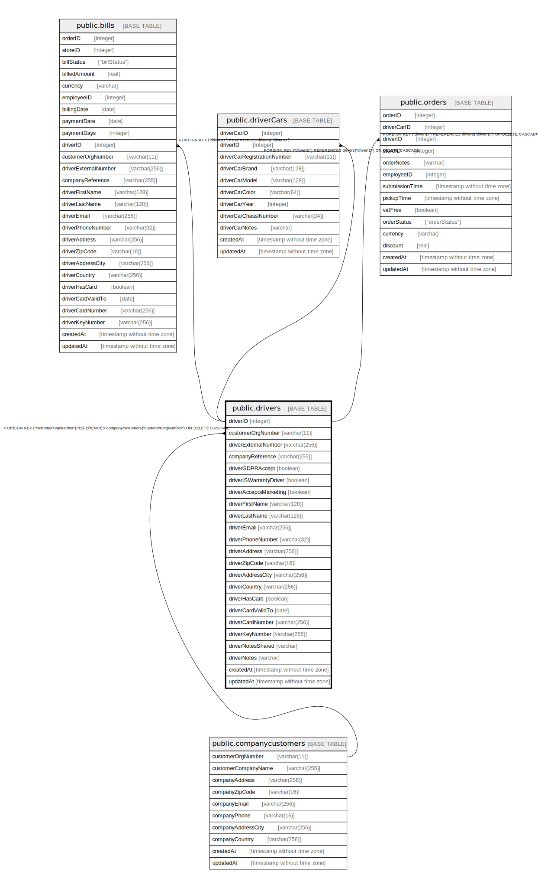

# public.drivers

## Description

## Columns

| Name | Type | Default | Nullable | Children | Parents | Comment |
| ---- | ---- | ------- | -------- | -------- | ------- | ------- |
| driverID | integer | nextval('"drivers_driverID_seq"'::regclass) | false | [public.bills](public.bills.md) [public.driverCars](public.driverCars.md) [public.orders](public.orders.md) |  |  |
| customerOrgNumber | varchar(11) |  | true |  | [public.companycustomers](public.companycustomers.md) |  |
| driverExternalNumber | varchar(256) |  | true |  |  |  |
| companyReference | varchar(255) |  | true |  |  |  |
| driverGDPRAccept | boolean | false | false |  |  |  |
| driverISWarrantyDriver | boolean | false | false |  |  |  |
| driverAcceptsMarketing | boolean | false | false |  |  |  |
| driverFirstName | varchar(128) |  | false |  |  |  |
| driverLastName | varchar(128) |  | false |  |  |  |
| driverEmail | varchar(256) |  | false |  |  |  |
| driverPhoneNumber | varchar(32) |  | false |  |  |  |
| driverAddress | varchar(256) |  | false |  |  |  |
| driverZipCode | varchar(16) |  | false |  |  |  |
| driverAddressCity | varchar(256) |  | false |  |  |  |
| driverCountry | varchar(256) |  | false |  |  |  |
| driverHasCard | boolean | false | true |  |  |  |
| driverCardValidTo | date |  | true |  |  |  |
| driverCardNumber | varchar(256) |  | true |  |  |  |
| driverKeyNumber | varchar(256) |  | true |  |  |  |
| driverNotesShared | varchar |  | true |  |  |  |
| driverNotes | varchar |  | true |  |  |  |
| createdAt | timestamp without time zone | now() | false |  |  |  |
| updatedAt | timestamp without time zone | now() | false |  |  |  |

## Constraints

| Name | Type | Definition |
| ---- | ---- | ---------- |
| drivers_customerOrgNumber_companycustomers_customerOrgNumber_fk | FOREIGN KEY | FOREIGN KEY ("customerOrgNumber") REFERENCES companycustomers("customerOrgNumber") ON DELETE CASCADE |
| drivers_pkey | PRIMARY KEY | PRIMARY KEY ("driverID") |
| drivers_driverEmail_unique | UNIQUE | UNIQUE ("driverEmail") |
| drivers_driverPhoneNumber_unique | UNIQUE | UNIQUE ("driverPhoneNumber") |

## Indexes

| Name | Definition |
| ---- | ---------- |
| drivers_pkey | CREATE UNIQUE INDEX drivers_pkey ON public.drivers USING btree ("driverID") |
| drivers_driverEmail_unique | CREATE UNIQUE INDEX "drivers_driverEmail_unique" ON public.drivers USING btree ("driverEmail") |
| drivers_driverPhoneNumber_unique | CREATE UNIQUE INDEX "drivers_driverPhoneNumber_unique" ON public.drivers USING btree ("driverPhoneNumber") |

## Relations

---

> Generated by [tbls](https://github.com/k1LoW/tbls)
