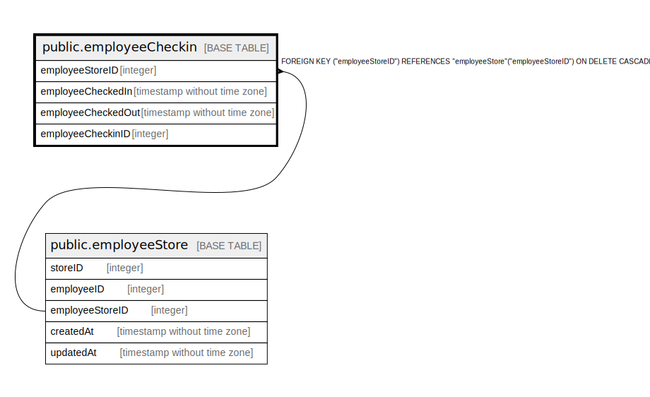

# public.employeeCheckin

## Description

## Columns

| Name | Type | Default | Nullable | Children | Parents | Comment |
| ---- | ---- | ------- | -------- | -------- | ------- | ------- |
| employeeCheckinID | integer | nextval('"employeeCheckin_employeeCheckinID_seq"'::regclass) | false |  |  |  |
| employeeStoreID | integer |  | true |  | [public.employeeStore](public.employeeStore.md) |  |
| employeeCheckedIn | timestamp without time zone |  | true |  |  |  |
| employeeCheckedOut | timestamp without time zone |  | true |  |  |  |

## Constraints

| Name | Type | Definition |
| ---- | ---- | ---------- |
| employeeCheckin_pkey | PRIMARY KEY | PRIMARY KEY ("employeeCheckinID") |
| employeeCheckin_employeeStoreID_employeeStore_employeeStoreID_f | FOREIGN KEY | FOREIGN KEY ("employeeStoreID") REFERENCES "employeeStore"("employeeStoreID") ON DELETE CASCADE |

## Indexes

| Name | Definition |
| ---- | ---------- |
| employeeCheckin_pkey | CREATE UNIQUE INDEX "employeeCheckin_pkey" ON public."employeeCheckin" USING btree ("employeeCheckinID") |
| checkinIndex | CREATE INDEX "checkinIndex" ON public."employeeCheckin" USING btree ("employeeCheckedIn") |

## Relations

---

> Generated by [tbls](https://github.com/k1LoW/tbls)
