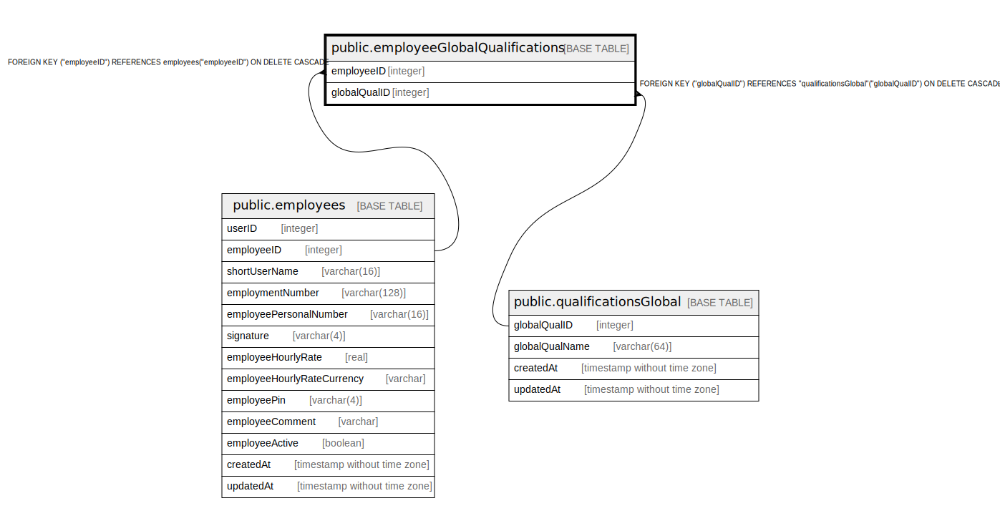

# public.employeeGlobalQualifications

## Description

## Columns

| Name | Type | Default | Nullable | Children | Parents | Comment |
| ---- | ---- | ------- | -------- | -------- | ------- | ------- |
| employeeID | integer |  | false |  | [public.employees](public.employees.md) |  |
| globalQualID | integer |  | false |  | [public.qualificationsGlobal](public.qualificationsGlobal.md) |  |

## Constraints

| Name | Type | Definition |
| ---- | ---- | ---------- |
| employeeGlobalQualifications_globalQualID_employeeID_pk | PRIMARY KEY | PRIMARY KEY ("globalQualID", "employeeID") |
| employeeGlobalQualifications_employeeID_employees_employeeID_fk | FOREIGN KEY | FOREIGN KEY ("employeeID") REFERENCES employees("employeeID") ON DELETE CASCADE |
| employeeGlobalQualifications_globalQualID_qualificationsGlobal_ | FOREIGN KEY | FOREIGN KEY ("globalQualID") REFERENCES "qualificationsGlobal"("globalQualID") ON DELETE CASCADE |

## Indexes

| Name | Definition |
| ---- | ---------- |
| employeeGlobalQualifications_globalQualID_employeeID_pk | CREATE UNIQUE INDEX "employeeGlobalQualifications_globalQualID_employeeID_pk" ON public."employeeGlobalQualifications" USING btree ("globalQualID", "employeeID") |

## Relations

---

> Generated by [tbls](https://github.com/k1LoW/tbls)
