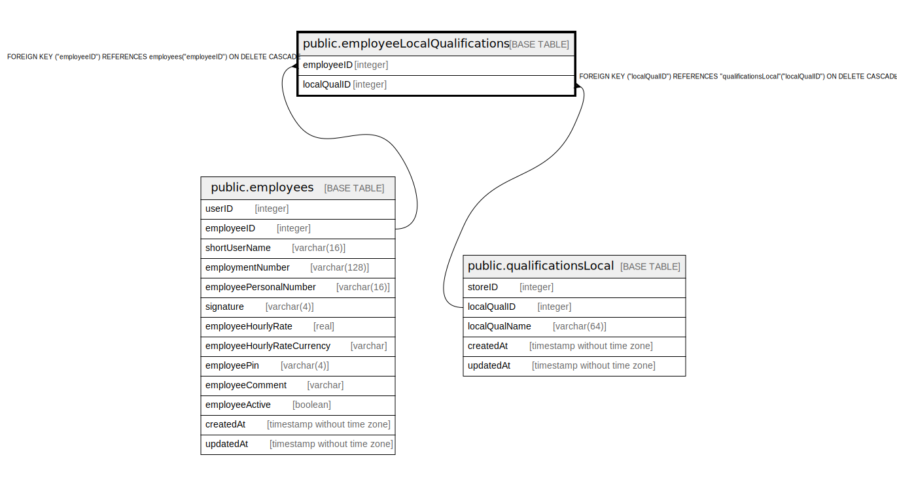

# public.employeeLocalQualifications

## Description

## Columns

| Name | Type | Default | Nullable | Children | Parents | Comment |
| ---- | ---- | ------- | -------- | -------- | ------- | ------- |
| employeeID | integer |  | false |  | [public.employees](public.employees.md) |  |
| localQualID | integer |  | false |  | [public.qualificationsLocal](public.qualificationsLocal.md) |  |

## Constraints

| Name | Type | Definition |
| ---- | ---- | ---------- |
| employeeLocalQualifications_localQualID_employeeID_pk | PRIMARY KEY | PRIMARY KEY ("localQualID", "employeeID") |
| employeeLocalQualifications_employeeID_employees_employeeID_fk | FOREIGN KEY | FOREIGN KEY ("employeeID") REFERENCES employees("employeeID") ON DELETE CASCADE |
| employeeLocalQualifications_localQualID_qualificationsLocal_loc | FOREIGN KEY | FOREIGN KEY ("localQualID") REFERENCES "qualificationsLocal"("localQualID") ON DELETE CASCADE |

## Indexes

| Name | Definition |
| ---- | ---------- |
| employeeLocalQualifications_localQualID_employeeID_pk | CREATE UNIQUE INDEX "employeeLocalQualifications_localQualID_employeeID_pk" ON public."employeeLocalQualifications" USING btree ("localQualID", "employeeID") |

## Relations

---

> Generated by [tbls](https://github.com/k1LoW/tbls)
