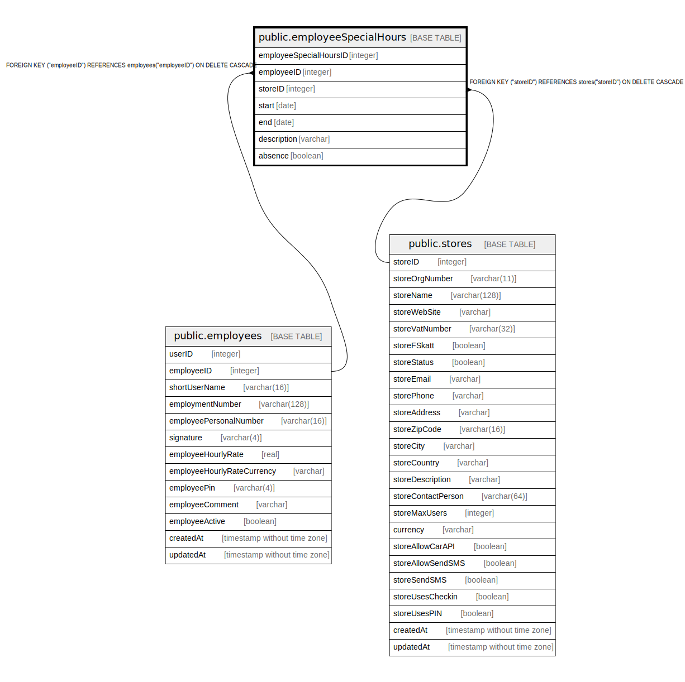

# public.employeeSpecialHours

## Description

## Columns

| Name | Type | Default | Nullable | Children | Parents | Comment |
| ---- | ---- | ------- | -------- | -------- | ------- | ------- |
| employeeSpecialHoursID | integer | nextval('"employeeSpecialHours_employeeSpecialHoursID_seq"'::regclass) | false |  |  |  |
| employeeID | integer |  | false |  | [public.employees](public.employees.md) |  |
| storeID | integer |  | false |  | [public.stores](public.stores.md) |  |
| start | date |  | false |  |  |  |
| end | date |  | false |  |  |  |
| description | varchar |  | true |  |  |  |
| absence | boolean |  | false |  |  |  |

## Constraints

| Name | Type | Definition |
| ---- | ---- | ---------- |
| employeeSpecialHours_pkey | PRIMARY KEY | PRIMARY KEY ("employeeSpecialHoursID") |
| employeeSpecialHours_start_employeeID_unique | UNIQUE | UNIQUE (start, "employeeID") |
| employeeSpecialHours_end_employeeID_unique | UNIQUE | UNIQUE ("end", "employeeID") |
| employeeSpecialHours_employeeID_employees_employeeID_fk | FOREIGN KEY | FOREIGN KEY ("employeeID") REFERENCES employees("employeeID") ON DELETE CASCADE |
| employeeSpecialHours_storeID_stores_storeID_fk | FOREIGN KEY | FOREIGN KEY ("storeID") REFERENCES stores("storeID") ON DELETE CASCADE |

## Indexes

| Name | Definition |
| ---- | ---------- |
| employeeSpecialHours_pkey | CREATE UNIQUE INDEX "employeeSpecialHours_pkey" ON public."employeeSpecialHours" USING btree ("employeeSpecialHoursID") |
| employeeSpecialHours_start_employeeID_unique | CREATE UNIQUE INDEX "employeeSpecialHours_start_employeeID_unique" ON public."employeeSpecialHours" USING btree (start, "employeeID") |
| employeeSpecialHours_end_employeeID_unique | CREATE UNIQUE INDEX "employeeSpecialHours_end_employeeID_unique" ON public."employeeSpecialHours" USING btree ("end", "employeeID") |

## Relations

---

> Generated by [tbls](https://github.com/k1LoW/tbls)
