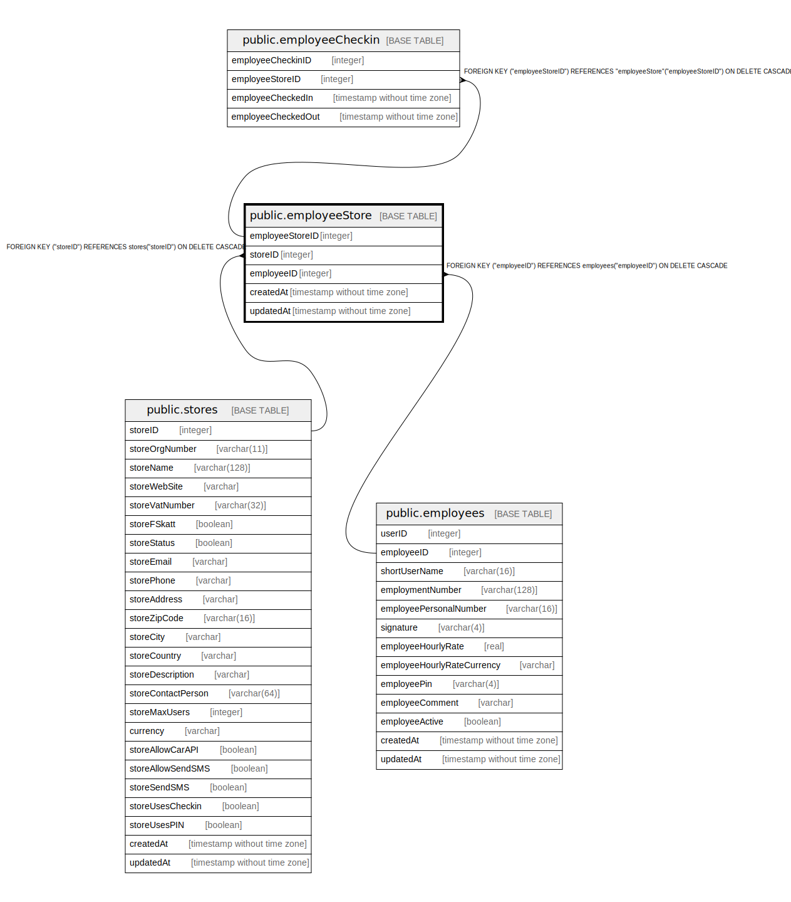

# public.employeeStore

## Description

## Columns

| Name | Type | Default | Nullable | Children | Parents | Comment |
| ---- | ---- | ------- | -------- | -------- | ------- | ------- |
| storeID | integer |  | false |  | [public.stores](public.stores.md) |  |
| employeeID | integer |  | false |  | [public.employees](public.employees.md) |  |
| employeeStoreID | integer | nextval('"employeeStore_employeeStoreID_seq"'::regclass) | false | [public.employeeCheckin](public.employeeCheckin.md) |  |  |
| createdAt | timestamp without time zone | now() | false |  |  |  |
| updatedAt | timestamp without time zone | now() | false |  |  |  |

## Constraints

| Name | Type | Definition |
| ---- | ---- | ---------- |
| employeeStore_employeeID_employees_employeeID_fk | FOREIGN KEY | FOREIGN KEY ("employeeID") REFERENCES employees("employeeID") ON DELETE CASCADE |
| employeeStore_storeID_stores_storeID_fk | FOREIGN KEY | FOREIGN KEY ("storeID") REFERENCES stores("storeID") ON DELETE CASCADE |
| employeeStore_pkey | PRIMARY KEY | PRIMARY KEY ("employeeStoreID") |

## Indexes

| Name | Definition |
| ---- | ---------- |
| employeeStore_pkey | CREATE UNIQUE INDEX "employeeStore_pkey" ON public."employeeStore" USING btree ("employeeStoreID") |

## Relations

---

> Generated by [tbls](https://github.com/k1LoW/tbls)
