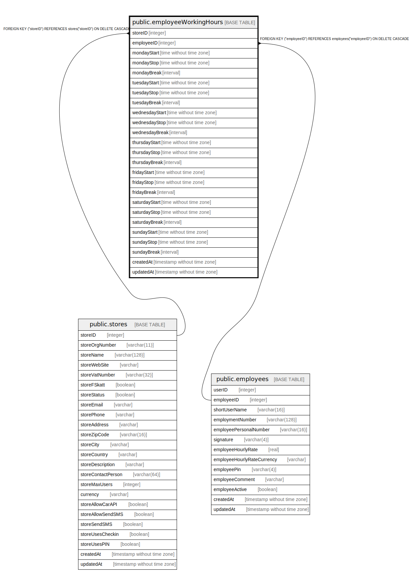

# public.employeeWorkingHours

## Description

## Columns

| Name | Type | Default | Nullable | Children | Parents | Comment |
| ---- | ---- | ------- | -------- | -------- | ------- | ------- |
| storeID | integer |  | false |  | [public.stores](public.stores.md) |  |
| employeeID | integer |  | false |  | [public.employees](public.employees.md) |  |
| mondayStart | time without time zone |  | true |  |  |  |
| mondayStop | time without time zone |  | true |  |  |  |
| mondayBreak | interval |  | true |  |  |  |
| tuesdayStart | time without time zone |  | true |  |  |  |
| tuesdayStop | time without time zone |  | true |  |  |  |
| tuesdayBreak | interval |  | true |  |  |  |
| wednesdayStart | time without time zone |  | true |  |  |  |
| wednesdayStop | time without time zone |  | true |  |  |  |
| wednesdayBreak | interval |  | true |  |  |  |
| thursdayStart | time without time zone |  | true |  |  |  |
| thursdayStop | time without time zone |  | true |  |  |  |
| thursdayBreak | interval |  | true |  |  |  |
| fridayStart | time without time zone |  | true |  |  |  |
| fridayStop | time without time zone |  | true |  |  |  |
| fridayBreak | interval |  | true |  |  |  |
| saturdayStart | time without time zone |  | true |  |  |  |
| saturdayStop | time without time zone |  | true |  |  |  |
| saturdayBreak | interval |  | true |  |  |  |
| sundayStart | time without time zone |  | true |  |  |  |
| sundayStop | time without time zone |  | true |  |  |  |
| sundayBreak | interval |  | true |  |  |  |
| createdAt | timestamp without time zone | now() | false |  |  |  |
| updatedAt | timestamp without time zone | now() | false |  |  |  |

## Constraints

| Name | Type | Definition |
| ---- | ---- | ---------- |
| employeeWorkingHours_storeID_employeeID_pk | PRIMARY KEY | PRIMARY KEY ("storeID", "employeeID") |
| employeeWorkingHours_employeeID_employees_employeeID_fk | FOREIGN KEY | FOREIGN KEY ("employeeID") REFERENCES employees("employeeID") ON DELETE CASCADE |
| employeeWorkingHours_storeID_stores_storeID_fk | FOREIGN KEY | FOREIGN KEY ("storeID") REFERENCES stores("storeID") ON DELETE CASCADE |

## Indexes

| Name | Definition |
| ---- | ---------- |
| employeeWorkingHours_storeID_employeeID_pk | CREATE UNIQUE INDEX "employeeWorkingHours_storeID_employeeID_pk" ON public."employeeWorkingHours" USING btree ("storeID", "employeeID") |

## Relations

---

> Generated by [tbls](https://github.com/k1LoW/tbls)
