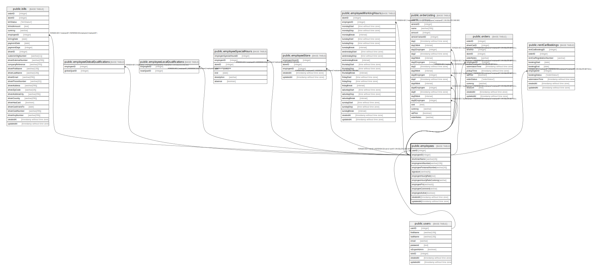

# public.employees

## Description

## Columns

| Name | Type | Default | Nullable | Children | Parents | Comment |
| ---- | ---- | ------- | -------- | -------- | ------- | ------- |
| userID | integer |  | false |  | [public.users](public.users.md) |  |
| employeeID | integer | nextval('"employees_employeeID_seq"'::regclass) | false | [public.employeeGlobalQualifications](public.employeeGlobalQualifications.md) [public.employeeLocalQualifications](public.employeeLocalQualifications.md) [public.employeeSpecialHours](public.employeeSpecialHours.md) [public.employeeStore](public.employeeStore.md) [public.employeeWorkingHours](public.employeeWorkingHours.md) [public.orderLocalServices](public.orderLocalServices.md) [public.orderServices](public.orderServices.md) [public.orders](public.orders.md) [public.rentCarBookings](public.rentCarBookings.md) [public.bills](public.bills.md) |  |  |
| shortUserName | varchar(16) |  | false |  |  |  |
| employmentNumber | varchar(128) |  | false |  |  |  |
| employeePersonalNumber | varchar(16) |  | false |  |  |  |
| signature | varchar(4) |  | false |  |  |  |
| employeeHourlyRate | real |  | true |  |  |  |
| employeeHourlyRateCurrency | varchar |  | true |  |  |  |
| employeePin | varchar(4) |  | false |  |  |  |
| employeeComment | varchar |  | true |  |  |  |
| employeeActive | boolean |  | false |  |  |  |
| createdAt | timestamp without time zone | now() | false |  |  |  |
| updatedAt | timestamp without time zone | now() | false |  |  |  |

## Constraints

| Name | Type | Definition |
| ---- | ---- | ---------- |
| employees_pkey | PRIMARY KEY | PRIMARY KEY ("employeeID") |
| employees_userID_unique | UNIQUE | UNIQUE ("userID") |
| employees_employmentNumber_unique | UNIQUE | UNIQUE ("employmentNumber") |
| employees_employeePersonalNumber_unique | UNIQUE | UNIQUE ("employeePersonalNumber") |
| employees_signature_unique | UNIQUE | UNIQUE (signature) |
| employees_userID_users_userID_fk | FOREIGN KEY | FOREIGN KEY ("userID") REFERENCES users("userID") ON DELETE CASCADE |

## Indexes

| Name | Definition |
| ---- | ---------- |
| employees_pkey | CREATE UNIQUE INDEX employees_pkey ON public.employees USING btree ("employeeID") |
| employees_userID_unique | CREATE UNIQUE INDEX "employees_userID_unique" ON public.employees USING btree ("userID") |
| employees_employmentNumber_unique | CREATE UNIQUE INDEX "employees_employmentNumber_unique" ON public.employees USING btree ("employmentNumber") |
| employees_employeePersonalNumber_unique | CREATE UNIQUE INDEX "employees_employeePersonalNumber_unique" ON public.employees USING btree ("employeePersonalNumber") |
| employees_signature_unique | CREATE UNIQUE INDEX employees_signature_unique ON public.employees USING btree (signature) |

## Relations

---

> Generated by [tbls](https://github.com/k1LoW/tbls)
