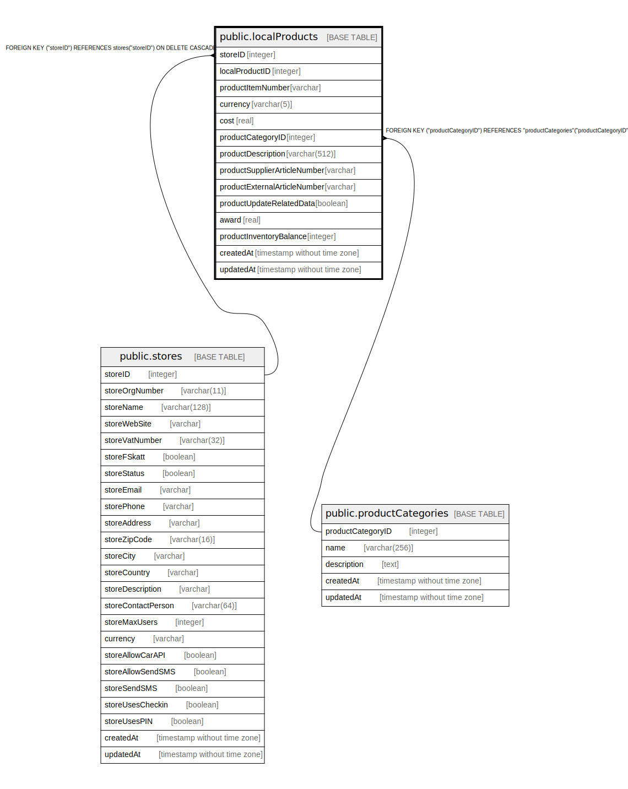

# public.localProducts

## Description

## Columns

| Name | Type | Default | Nullable | Children | Parents | Comment |
| ---- | ---- | ------- | -------- | -------- | ------- | ------- |
| storeID | integer |  | false |  | [public.stores](public.stores.md) |  |
| localProductID | integer | nextval('"localProducts_localProductID_seq"'::regclass) | false |  |  |  |
| productItemNumber | varchar |  | false |  |  |  |
| currency | varchar(5) |  | false |  |  |  |
| cost | real |  | false |  |  |  |
| productCategoryID | integer |  | false |  | [public.productCategories](public.productCategories.md) |  |
| productDescription | varchar(512) |  | true |  |  |  |
| productSupplierArticleNumber | varchar |  | true |  |  |  |
| productExternalArticleNumber | varchar |  | true |  |  |  |
| productUpdateRelatedData | boolean | false | true |  |  |  |
| award | real |  | false |  |  |  |
| productInventoryBalance | integer |  | true |  |  |  |
| createdAt | timestamp without time zone | now() | false |  |  |  |
| updatedAt | timestamp without time zone | now() | false |  |  |  |

## Constraints

| Name | Type | Definition |
| ---- | ---- | ---------- |
| localProducts_pkey | PRIMARY KEY | PRIMARY KEY ("localProductID") |
| localProducts_productCategoryID_productCategories_productCatego | FOREIGN KEY | FOREIGN KEY ("productCategoryID") REFERENCES "productCategories"("productCategoryID") |
| localProducts_storeID_stores_storeID_fk | FOREIGN KEY | FOREIGN KEY ("storeID") REFERENCES stores("storeID") ON DELETE CASCADE |

## Indexes

| Name | Definition |
| ---- | ---------- |
| localProducts_pkey | CREATE UNIQUE INDEX "localProducts_pkey" ON public."localProducts" USING btree ("localProductID") |

## Relations

---

> Generated by [tbls](https://github.com/k1LoW/tbls)
