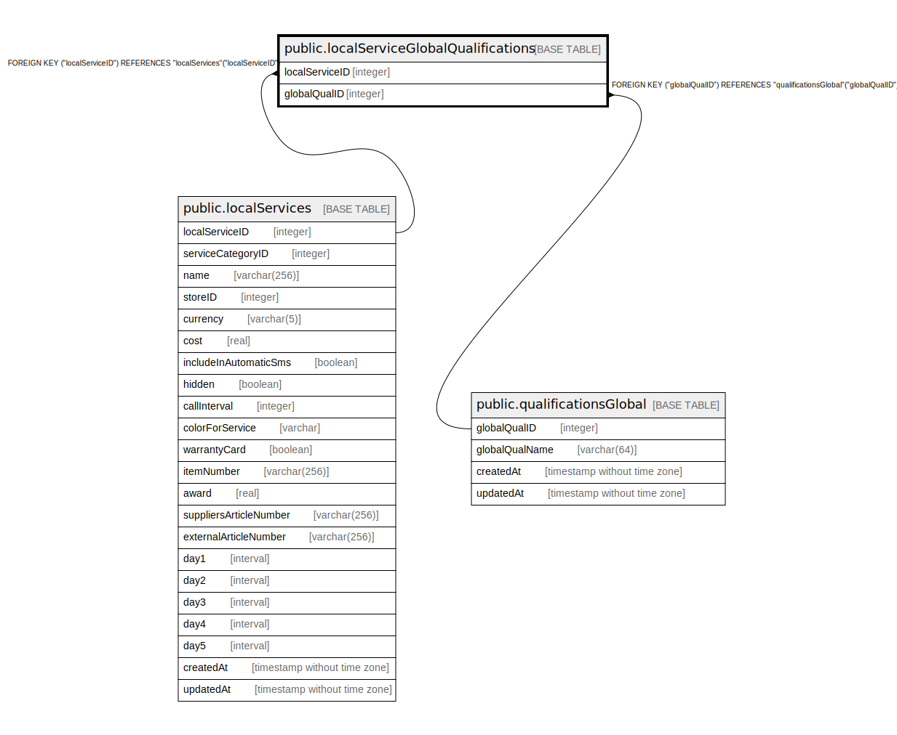

# public.localServiceGlobalQualifications

## Description

## Columns

| Name | Type | Default | Nullable | Children | Parents | Comment |
| ---- | ---- | ------- | -------- | -------- | ------- | ------- |
| localServiceID | integer |  | false |  | [public.localServices](public.localServices.md) |  |
| globalQualID | integer |  | false |  | [public.qualificationsGlobal](public.qualificationsGlobal.md) |  |

## Constraints

| Name | Type | Definition |
| ---- | ---- | ---------- |
| localServiceGlobalQualifications_localServiceID_localServices_l | FOREIGN KEY | FOREIGN KEY ("localServiceID") REFERENCES "localServices"("localServiceID") |
| localServiceGlobalQualifications_globalQualID_qualificationsGlo | FOREIGN KEY | FOREIGN KEY ("globalQualID") REFERENCES "qualificationsGlobal"("globalQualID") |

## Relations

---

> Generated by [tbls](https://github.com/k1LoW/tbls)
