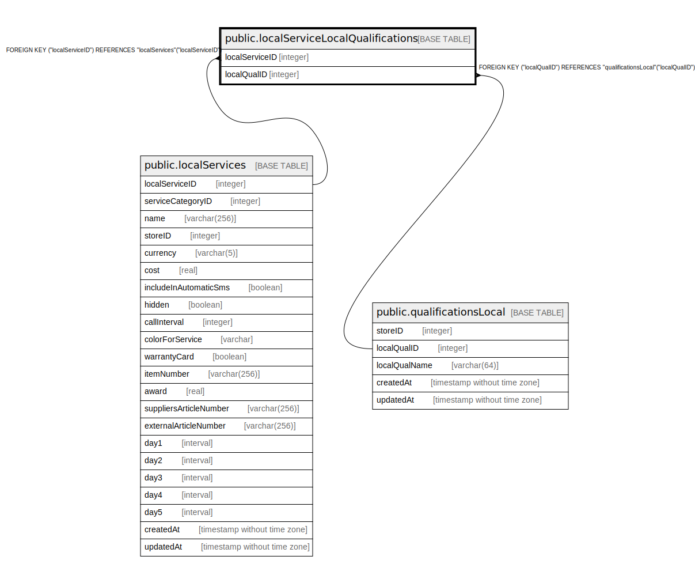

# public.localServiceLocalQualifications

## Description

## Columns

| Name | Type | Default | Nullable | Children | Parents | Comment |
| ---- | ---- | ------- | -------- | -------- | ------- | ------- |
| localServiceID | integer |  | false |  | [public.localServices](public.localServices.md) |  |
| localQualID | integer |  | false |  | [public.qualificationsLocal](public.qualificationsLocal.md) |  |

## Constraints

| Name | Type | Definition |
| ---- | ---- | ---------- |
| localServiceLocalQualifications_localQualID_localServiceID_pk | PRIMARY KEY | PRIMARY KEY ("localQualID", "localServiceID") |
| localServiceLocalQualifications_localServiceID_localServices_lo | FOREIGN KEY | FOREIGN KEY ("localServiceID") REFERENCES "localServices"("localServiceID") |
| localServiceLocalQualifications_localQualID_qualificationsLocal | FOREIGN KEY | FOREIGN KEY ("localQualID") REFERENCES "qualificationsLocal"("localQualID") |

## Indexes

| Name | Definition |
| ---- | ---------- |
| localServiceLocalQualifications_localQualID_localServiceID_pk | CREATE UNIQUE INDEX "localServiceLocalQualifications_localQualID_localServiceID_pk" ON public."localServiceLocalQualifications" USING btree ("localQualID", "localServiceID") |

## Relations

---

> Generated by [tbls](https://github.com/k1LoW/tbls)
