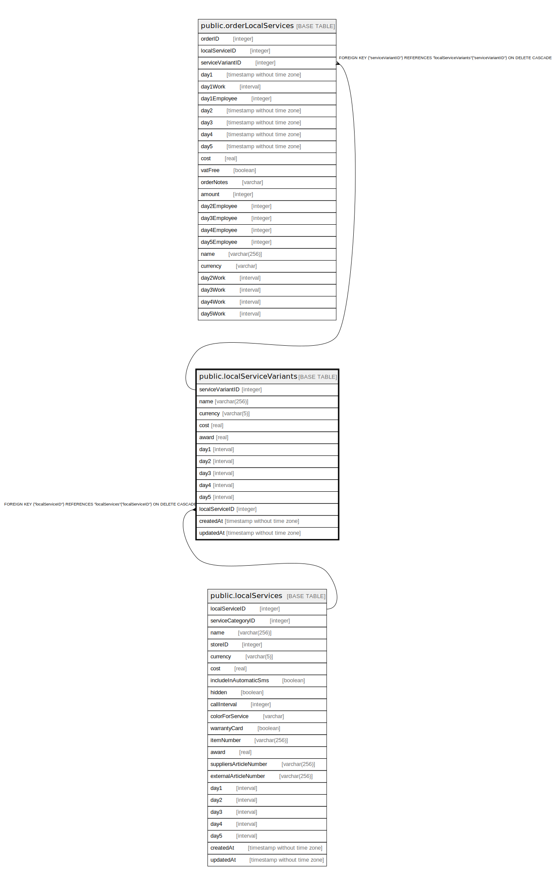

# public.localServiceVariants

## Description

## Columns

| Name | Type | Default | Nullable | Children | Parents | Comment |
| ---- | ---- | ------- | -------- | -------- | ------- | ------- |
| serviceVariantID | integer | nextval('"localServiceVariants_serviceVariantID_seq"'::regclass) | false | [public.orderLocalServices](public.orderLocalServices.md) |  |  |
| name | varchar(256) |  | false |  |  |  |
| currency | varchar(5) |  | false |  |  |  |
| cost | real |  | false |  |  |  |
| award | real |  | false |  |  |  |
| day1 | time without time zone |  | true |  |  |  |
| day2 | time without time zone |  | true |  |  |  |
| day3 | time without time zone |  | true |  |  |  |
| day4 | time without time zone |  | true |  |  |  |
| day5 | time without time zone |  | true |  |  |  |
| localServiceID | integer |  | false |  | [public.localServices](public.localServices.md) |  |
| createdAt | timestamp without time zone | now() | false |  |  |  |
| updatedAt | timestamp without time zone | now() | false |  |  |  |

## Constraints

| Name | Type | Definition |
| ---- | ---- | ---------- |
| localServiceVariants_pkey | PRIMARY KEY | PRIMARY KEY ("serviceVariantID") |
| localServiceVariants_localServiceID_localServices_localServiceI | FOREIGN KEY | FOREIGN KEY ("localServiceID") REFERENCES "localServices"("localServiceID") ON DELETE CASCADE |

## Indexes

| Name | Definition |
| ---- | ---------- |
| localServiceVariants_pkey | CREATE UNIQUE INDEX "localServiceVariants_pkey" ON public."localServiceVariants" USING btree ("serviceVariantID") |

## Relations

---

> Generated by [tbls](https://github.com/k1LoW/tbls)
