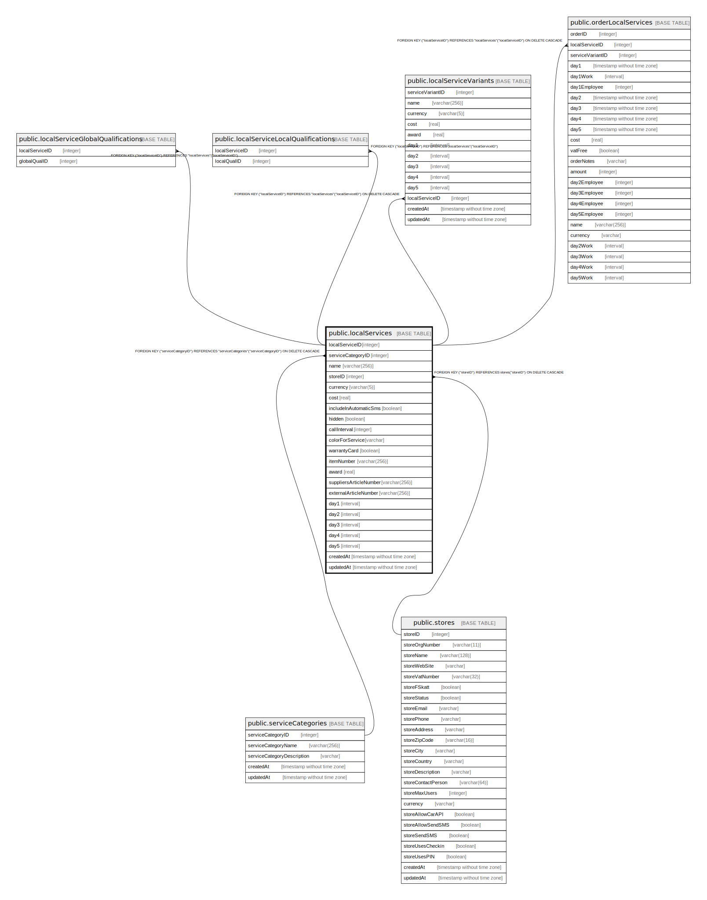

# public.localServices

## Description

## Columns

| Name | Type | Default | Nullable | Children | Parents | Comment |
| ---- | ---- | ------- | -------- | -------- | ------- | ------- |
| localServiceID | integer | nextval('"localServices_localServiceID_seq"'::regclass) | false | [public.localServiceGlobalQualifications](public.localServiceGlobalQualifications.md) [public.localServiceLocalQualifications](public.localServiceLocalQualifications.md) [public.localServiceVariants](public.localServiceVariants.md) [public.orderLocalServices](public.orderLocalServices.md) |  |  |
| serviceCategoryID | integer |  | false |  | [public.serviceCategories](public.serviceCategories.md) |  |
| name | varchar(256) |  | false |  |  |  |
| storeID | integer |  | false |  | [public.stores](public.stores.md) |  |
| currency | varchar(5) |  | false |  |  |  |
| cost | real |  | false |  |  |  |
| includeInAutomaticSms | boolean |  | false |  |  |  |
| hidden | boolean |  | false |  |  |  |
| callInterval | integer |  | true |  |  |  |
| colorForService | varchar |  | false |  |  |  |
| warrantyCard | boolean |  | true |  |  |  |
| itemNumber | varchar(256) |  | true |  |  |  |
| award | real |  | false |  |  |  |
| suppliersArticleNumber | varchar(256) |  | true |  |  |  |
| externalArticleNumber | varchar(256) |  | true |  |  |  |
| day1 | interval |  | true |  |  |  |
| day2 | interval |  | true |  |  |  |
| day3 | interval |  | true |  |  |  |
| day4 | interval |  | true |  |  |  |
| day5 | interval |  | true |  |  |  |
| createdAt | timestamp without time zone | now() | false |  |  |  |
| updatedAt | timestamp without time zone | now() | false |  |  |  |

## Constraints

| Name | Type | Definition |
| ---- | ---- | ---------- |
| localServices_pkey | PRIMARY KEY | PRIMARY KEY ("localServiceID") |
| localServices_serviceCategoryID_serviceCategories_serviceCatego | FOREIGN KEY | FOREIGN KEY ("serviceCategoryID") REFERENCES "serviceCategories"("serviceCategoryID") ON DELETE CASCADE |
| localServices_storeID_stores_storeID_fk | FOREIGN KEY | FOREIGN KEY ("storeID") REFERENCES stores("storeID") ON DELETE CASCADE |

## Indexes

| Name | Definition |
| ---- | ---------- |
| localServices_pkey | CREATE UNIQUE INDEX "localServices_pkey" ON public."localServices" USING btree ("localServiceID") |

## Relations

---

> Generated by [tbls](https://github.com/k1LoW/tbls)
