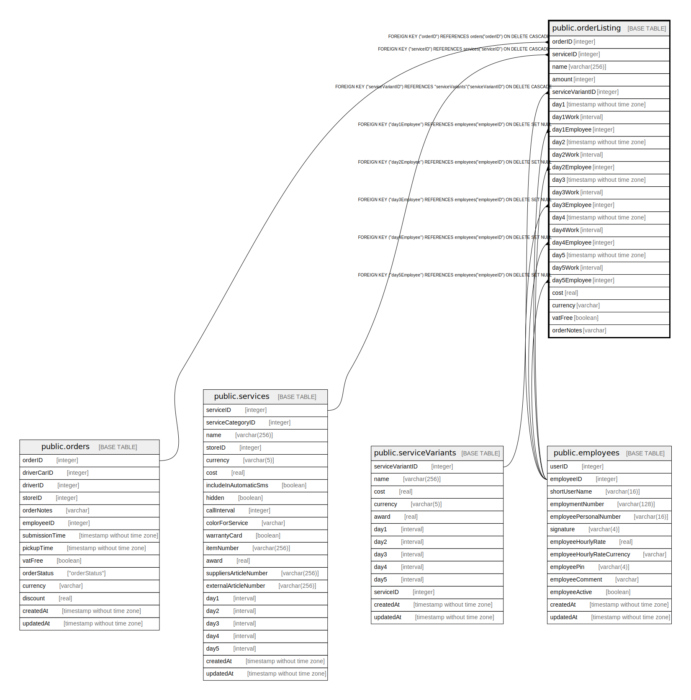

# public.orderListing

## Description

## Columns

| Name | Type | Default | Nullable | Children | Parents | Comment |
| ---- | ---- | ------- | -------- | -------- | ------- | ------- |
| orderID | integer |  | false |  | [public.orders](public.orders.md) |  |
| serviceID | integer |  | false |  | [public.services](public.services.md) |  |
| name | varchar(256) |  | false |  |  |  |
| amount | integer |  | false |  |  |  |
| serviceVariantID | integer |  | true |  | [public.serviceVariants](public.serviceVariants.md) |  |
| day1 | timestamp without time zone |  | true |  |  |  |
| day1Work | interval |  | true |  |  |  |
| day1Employee | integer |  | true |  | [public.employees](public.employees.md) |  |
| day2 | timestamp without time zone |  | true |  |  |  |
| day2Work | interval |  | true |  |  |  |
| day2Employee | integer |  | true |  | [public.employees](public.employees.md) |  |
| day3 | timestamp without time zone |  | true |  |  |  |
| day3Work | interval |  | true |  |  |  |
| day3Employee | integer |  | true |  | [public.employees](public.employees.md) |  |
| day4 | timestamp without time zone |  | true |  |  |  |
| day4Work | interval |  | true |  |  |  |
| day4Employee | integer |  | true |  | [public.employees](public.employees.md) |  |
| day5 | timestamp without time zone |  | true |  |  |  |
| day5Work | interval |  | true |  |  |  |
| day5Employee | integer |  | true |  | [public.employees](public.employees.md) |  |
| cost | real |  | false |  |  |  |
| currency | varchar |  | false |  |  |  |
| vatFree | boolean |  | false |  |  |  |
| orderNotes | varchar |  | true |  |  |  |

## Constraints

| Name | Type | Definition |
| ---- | ---- | ---------- |
| orderListing_day1Employee_employees_employeeID_fk | FOREIGN KEY | FOREIGN KEY ("day1Employee") REFERENCES employees("employeeID") ON DELETE SET NULL |
| orderListing_day2Employee_employees_employeeID_fk | FOREIGN KEY | FOREIGN KEY ("day2Employee") REFERENCES employees("employeeID") ON DELETE SET NULL |
| orderListing_day3Employee_employees_employeeID_fk | FOREIGN KEY | FOREIGN KEY ("day3Employee") REFERENCES employees("employeeID") ON DELETE SET NULL |
| orderListing_day4Employee_employees_employeeID_fk | FOREIGN KEY | FOREIGN KEY ("day4Employee") REFERENCES employees("employeeID") ON DELETE SET NULL |
| orderListing_day5Employee_employees_employeeID_fk | FOREIGN KEY | FOREIGN KEY ("day5Employee") REFERENCES employees("employeeID") ON DELETE SET NULL |
| orderListing_orderID_serviceID_pk | PRIMARY KEY | PRIMARY KEY ("orderID", "serviceID") |
| orderListing_orderID_orders_orderID_fk | FOREIGN KEY | FOREIGN KEY ("orderID") REFERENCES orders("orderID") ON DELETE CASCADE |
| orderListing_serviceVariantID_serviceVariants_serviceVariantID_ | FOREIGN KEY | FOREIGN KEY ("serviceVariantID") REFERENCES "serviceVariants"("serviceVariantID") ON DELETE CASCADE |
| orderListing_serviceID_services_serviceID_fk | FOREIGN KEY | FOREIGN KEY ("serviceID") REFERENCES services("serviceID") ON DELETE CASCADE |

## Indexes

| Name | Definition |
| ---- | ---------- |
| orderListing_orderID_serviceID_pk | CREATE UNIQUE INDEX "orderListing_orderID_serviceID_pk" ON public."orderListing" USING btree ("orderID", "serviceID") |

## Relations

---

> Generated by [tbls](https://github.com/k1LoW/tbls)
