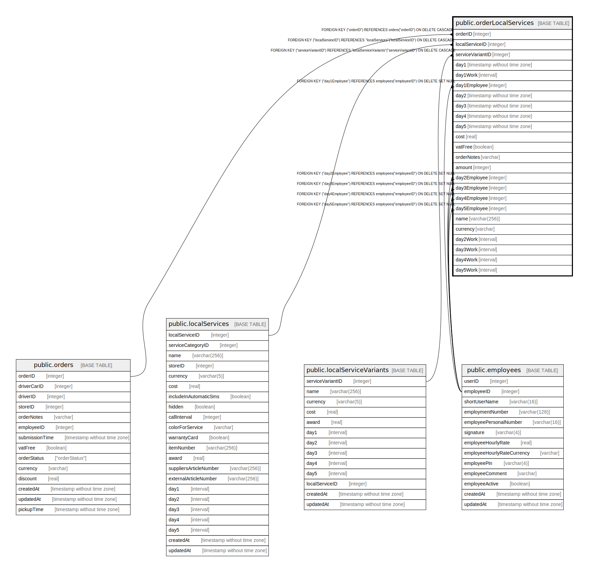

# public.orderLocalServices

## Description

## Columns

| Name | Type | Default | Nullable | Children | Parents | Comment |
| ---- | ---- | ------- | -------- | -------- | ------- | ------- |
| orderID | integer |  | false |  | [public.orders](public.orders.md) |  |
| localServiceID | integer |  | false |  | [public.localServices](public.localServices.md) |  |
| serviceVariantID | integer |  | true |  | [public.localServiceVariants](public.localServiceVariants.md) |  |
| day1 | timestamp without time zone |  | true |  |  |  |
| day1Work | interval |  | true |  |  |  |
| employeeID | integer |  | true |  | [public.employees](public.employees.md) |  |
| day2 | timestamp without time zone |  | true |  |  |  |
| day3 | timestamp without time zone |  | true |  |  |  |
| day4 | timestamp without time zone |  | true |  |  |  |
| day5 | timestamp without time zone |  | true |  |  |  |
| cost | real |  | false |  |  |  |
| discount | real |  | false |  |  |  |
| vatFree | boolean |  | false |  |  |  |
| orderNotes | varchar |  | true |  |  |  |
| amount | integer |  | false |  |  |  |

## Constraints

| Name | Type | Definition |
| ---- | ---- | ---------- |
| orderLocalServices_employeeID_employees_employeeID_fk | FOREIGN KEY | FOREIGN KEY ("employeeID") REFERENCES employees("employeeID") ON DELETE SET NULL |
| orderLocalServices_serviceVariantID_localServiceVariants_servic | FOREIGN KEY | FOREIGN KEY ("serviceVariantID") REFERENCES "localServiceVariants"("serviceVariantID") ON DELETE CASCADE |
| orderLocalServices_localServiceID_localServices_localServiceID_ | FOREIGN KEY | FOREIGN KEY ("localServiceID") REFERENCES "localServices"("localServiceID") ON DELETE CASCADE |
| orderLocalServices_orderID_localServiceID_pk | PRIMARY KEY | PRIMARY KEY ("orderID", "localServiceID") |
| orderLocalServices_orderID_orders_orderID_fk | FOREIGN KEY | FOREIGN KEY ("orderID") REFERENCES orders("orderID") ON DELETE CASCADE |

## Indexes

| Name | Definition |
| ---- | ---------- |
| orderLocalServices_orderID_localServiceID_pk | CREATE UNIQUE INDEX "orderLocalServices_orderID_localServiceID_pk" ON public."orderLocalServices" USING btree ("orderID", "localServiceID") |

## Relations

---

> Generated by [tbls](https://github.com/k1LoW/tbls)
