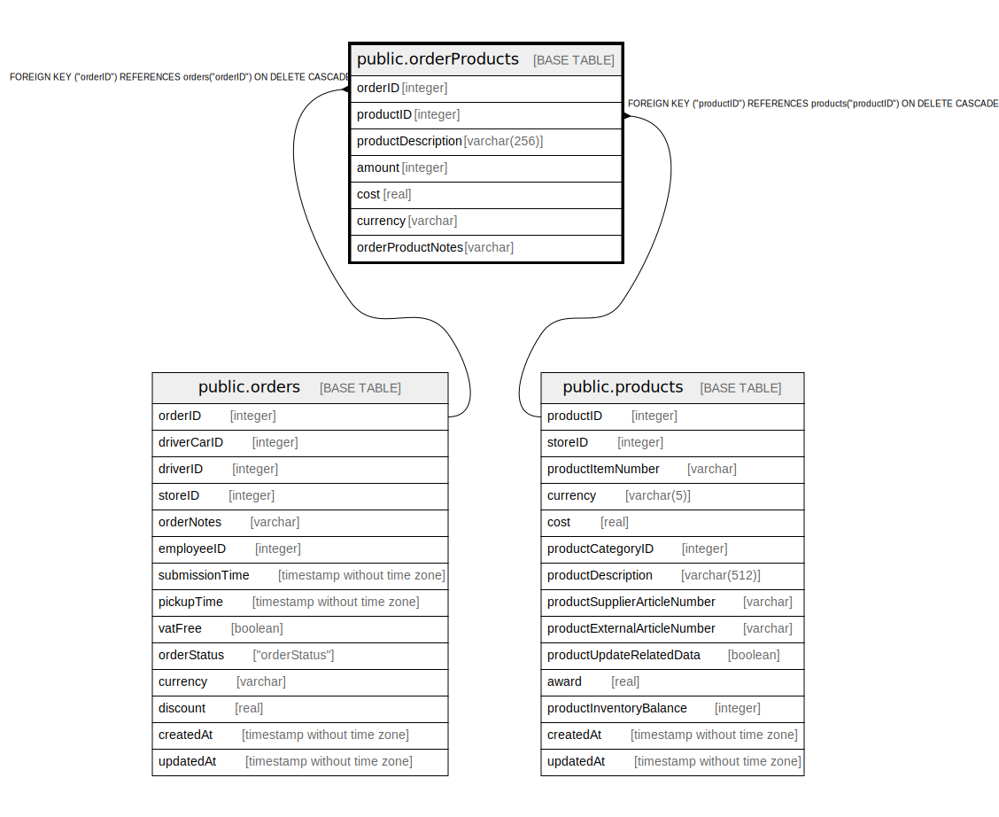

# public.orderProducts

## Description

## Columns

| Name | Type | Default | Nullable | Children | Parents | Comment |
| ---- | ---- | ------- | -------- | -------- | ------- | ------- |
| orderID | integer |  | false |  | [public.orders](public.orders.md) |  |
| productID | integer |  | false |  | [public.products](public.products.md) |  |
| productDescription | varchar(256) |  | false |  |  |  |
| amount | integer |  | false |  |  |  |
| cost | real |  | false |  |  |  |
| currency | varchar |  | false |  |  |  |
| orderProductNotes | varchar |  | true |  |  |  |

## Constraints

| Name | Type | Definition |
| ---- | ---- | ---------- |
| orderProducts_orderID_productID_pk | PRIMARY KEY | PRIMARY KEY ("orderID", "productID") |
| orderProducts_orderID_orders_orderID_fk | FOREIGN KEY | FOREIGN KEY ("orderID") REFERENCES orders("orderID") ON DELETE CASCADE |
| orderProducts_productID_products_productID_fk | FOREIGN KEY | FOREIGN KEY ("productID") REFERENCES products("productID") ON DELETE CASCADE |

## Indexes

| Name | Definition |
| ---- | ---------- |
| orderProducts_orderID_productID_pk | CREATE UNIQUE INDEX "orderProducts_orderID_productID_pk" ON public."orderProducts" USING btree ("orderID", "productID") |

## Relations

---

> Generated by [tbls](https://github.com/k1LoW/tbls)
