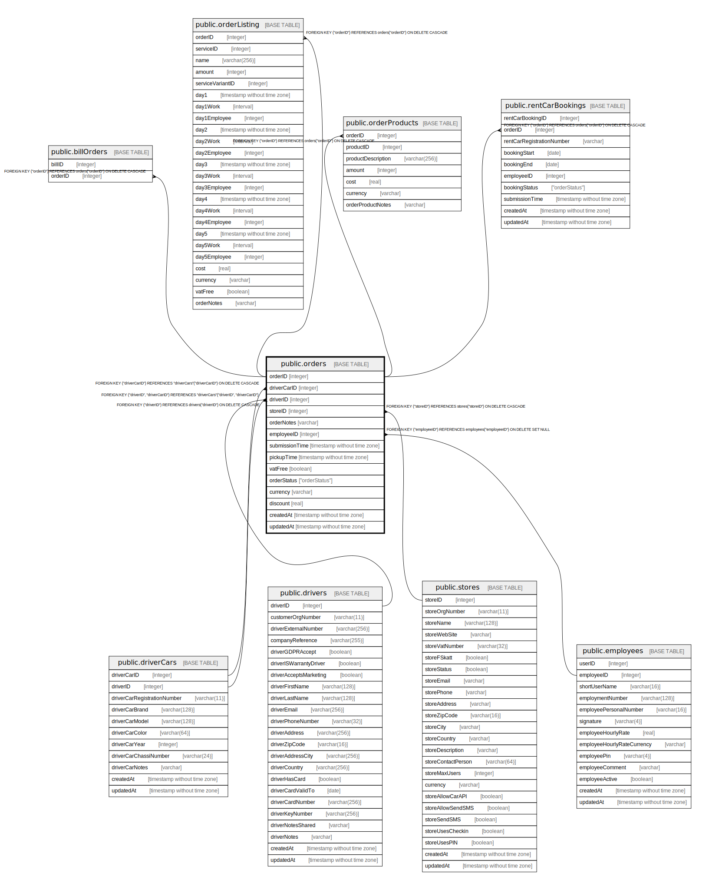

# public.orders

## Description

## Columns

| Name | Type | Default | Nullable | Children | Parents | Comment |
| ---- | ---- | ------- | -------- | -------- | ------- | ------- |
| orderID | integer | nextval('"orders_orderID_seq"'::regclass) | false | [public.billOrders](public.billOrders.md) [public.orderListing](public.orderListing.md) [public.rentCarBookings](public.rentCarBookings.md) [public.orderProducts](public.orderProducts.md) |  |  |
| driverCarID | integer |  | false |  | [public.driverCars](public.driverCars.md) |  |
| driverID | integer |  | false |  | [public.driverCars](public.driverCars.md) [public.drivers](public.drivers.md) |  |
| storeID | integer |  | false |  | [public.stores](public.stores.md) |  |
| orderNotes | varchar |  | true |  |  |  |
| employeeID | integer |  | true |  | [public.employees](public.employees.md) |  |
| submissionTime | timestamp without time zone |  | false |  |  |  |
| pickupTime | timestamp without time zone |  | false |  |  |  |
| vatFree | boolean |  | false |  |  |  |
| orderStatus | "orderStatus" |  | false |  |  |  |
| currency | varchar |  | false |  |  |  |
| discount | real |  | false |  |  |  |
| createdAt | timestamp without time zone |  | false |  |  |  |
| updatedAt | timestamp without time zone |  | false |  |  |  |

## Constraints

| Name | Type | Definition |
| ---- | ---- | ---------- |
| orders_driverCarID_driverCars_driverCarID_fk | FOREIGN KEY | FOREIGN KEY ("driverCarID") REFERENCES "driverCars"("driverCarID") ON DELETE CASCADE |
| driver_must_have_car | FOREIGN KEY | FOREIGN KEY ("driverID", "driverCarID") REFERENCES "driverCars"("driverID", "driverCarID") |
| orders_driverID_drivers_driverID_fk | FOREIGN KEY | FOREIGN KEY ("driverID") REFERENCES drivers("driverID") ON DELETE CASCADE |
| orders_employeeID_employees_employeeID_fk | FOREIGN KEY | FOREIGN KEY ("employeeID") REFERENCES employees("employeeID") ON DELETE SET NULL |
| orders_pkey | PRIMARY KEY | PRIMARY KEY ("orderID") |
| orders_storeID_stores_storeID_fk | FOREIGN KEY | FOREIGN KEY ("storeID") REFERENCES stores("storeID") ON DELETE CASCADE |

## Indexes

| Name | Definition |
| ---- | ---------- |
| orders_pkey | CREATE UNIQUE INDEX orders_pkey ON public.orders USING btree ("orderID") |

## Relations

---

> Generated by [tbls](https://github.com/k1LoW/tbls)
