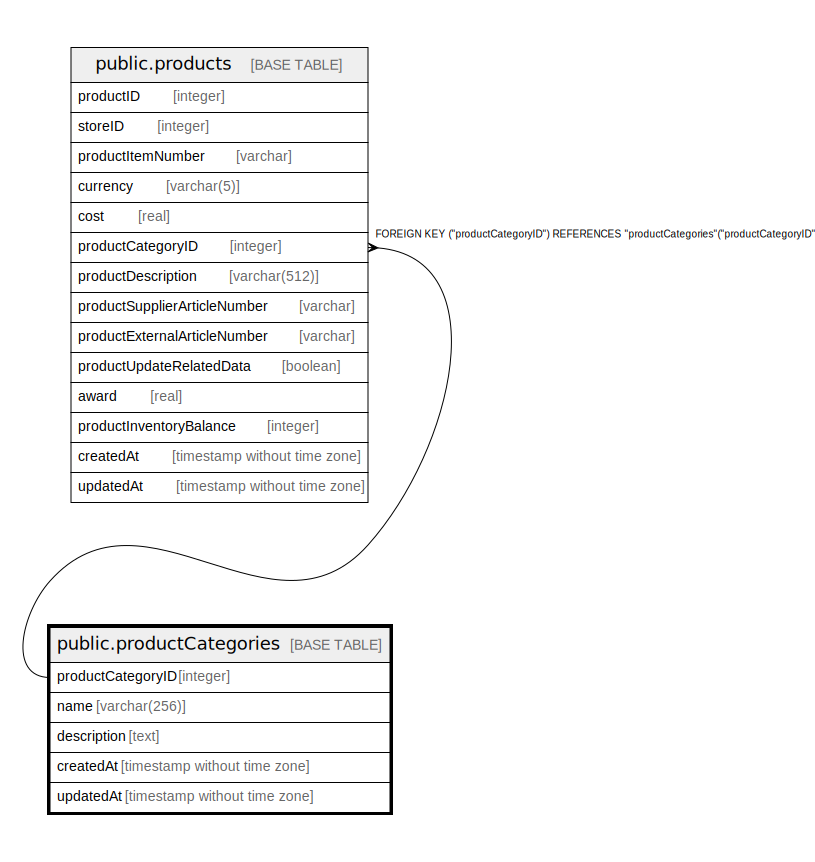

# public.productCategories

## Description

## Columns

| Name | Type | Default | Nullable | Children | Parents | Comment |
| ---- | ---- | ------- | -------- | -------- | ------- | ------- |
| productCategoryID | integer | nextval('"productCategories_productCategoryID_seq"'::regclass) | false | [public.localProducts](public.localProducts.md) [public.products](public.products.md) |  |  |
| name | varchar(256) |  | false |  |  |  |
| description | text |  | true |  |  |  |
| createdAt | timestamp without time zone | now() | false |  |  |  |
| updatedAt | timestamp without time zone | now() | false |  |  |  |

## Constraints

| Name | Type | Definition |
| ---- | ---- | ---------- |
| productCategories_pkey | PRIMARY KEY | PRIMARY KEY ("productCategoryID") |
| productCategories_name_unique | UNIQUE | UNIQUE (name) |

## Indexes

| Name | Definition |
| ---- | ---------- |
| productCategories_pkey | CREATE UNIQUE INDEX "productCategories_pkey" ON public."productCategories" USING btree ("productCategoryID") |
| productCategories_name_unique | CREATE UNIQUE INDEX "productCategories_name_unique" ON public."productCategories" USING btree (name) |

## Relations

---

> Generated by [tbls](https://github.com/k1LoW/tbls)
