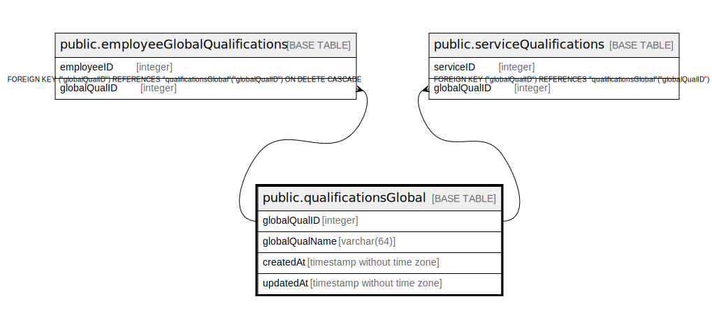

# public.qualificationsGlobal

## Description

## Columns

| Name | Type | Default | Nullable | Children | Parents | Comment |
| ---- | ---- | ------- | -------- | -------- | ------- | ------- |
| globalQualID | integer | nextval('"qualificationsGlobal_globalQualID_seq"'::regclass) | false | [public.employeeGlobalQualifications](public.employeeGlobalQualifications.md) [public.serviceQualifications](public.serviceQualifications.md) |  |  |
| globalQualName | varchar(64) |  | false |  |  |  |
| createdAt | timestamp without time zone | now() | false |  |  |  |
| updatedAt | timestamp without time zone | now() | false |  |  |  |

## Constraints

| Name | Type | Definition |
| ---- | ---- | ---------- |
| qualificationsGlobal_pkey | PRIMARY KEY | PRIMARY KEY ("globalQualID") |
| qualificationsGlobal_globalQualName_unique | UNIQUE | UNIQUE ("globalQualName") |

## Indexes

| Name | Definition |
| ---- | ---------- |
| qualificationsGlobal_pkey | CREATE UNIQUE INDEX "qualificationsGlobal_pkey" ON public."qualificationsGlobal" USING btree ("globalQualID") |
| qualificationsGlobal_globalQualName_unique | CREATE UNIQUE INDEX "qualificationsGlobal_globalQualName_unique" ON public."qualificationsGlobal" USING btree ("globalQualName") |

## Relations

---

> Generated by [tbls](https://github.com/k1LoW/tbls)
