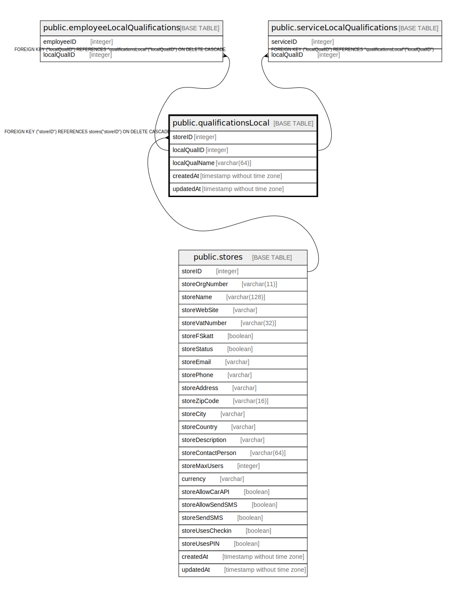

# public.qualificationsLocal

## Description

## Columns

| Name | Type | Default | Nullable | Children | Parents | Comment |
| ---- | ---- | ------- | -------- | -------- | ------- | ------- |
| storeID | integer |  | false |  | [public.stores](public.stores.md) |  |
| localQualID | integer | nextval('"qualificationsLocal_localQualID_seq"'::regclass) | false | [public.employeeLocalQualifications](public.employeeLocalQualifications.md) [public.localServiceLocalQualifications](public.localServiceLocalQualifications.md) [public.serviceLocalQualifications](public.serviceLocalQualifications.md) |  |  |
| localQualName | varchar(64) |  | false |  |  |  |
| createdAt | timestamp without time zone | now() | false |  |  |  |
| updatedAt | timestamp without time zone | now() | false |  |  |  |

## Constraints

| Name | Type | Definition |
| ---- | ---- | ---------- |
| qualificationsLocal_pkey | PRIMARY KEY | PRIMARY KEY ("localQualID") |
| qualificationsLocal_localQualName_storeID_unique | UNIQUE | UNIQUE ("localQualName", "storeID") |
| qualificationsLocal_storeID_stores_storeID_fk | FOREIGN KEY | FOREIGN KEY ("storeID") REFERENCES stores("storeID") ON DELETE CASCADE |

## Indexes

| Name | Definition |
| ---- | ---------- |
| qualificationsLocal_pkey | CREATE UNIQUE INDEX "qualificationsLocal_pkey" ON public."qualificationsLocal" USING btree ("localQualID") |
| qualificationsLocal_localQualName_storeID_unique | CREATE UNIQUE INDEX "qualificationsLocal_localQualName_storeID_unique" ON public."qualificationsLocal" USING btree ("localQualName", "storeID") |

## Relations

---

> Generated by [tbls](https://github.com/k1LoW/tbls)
