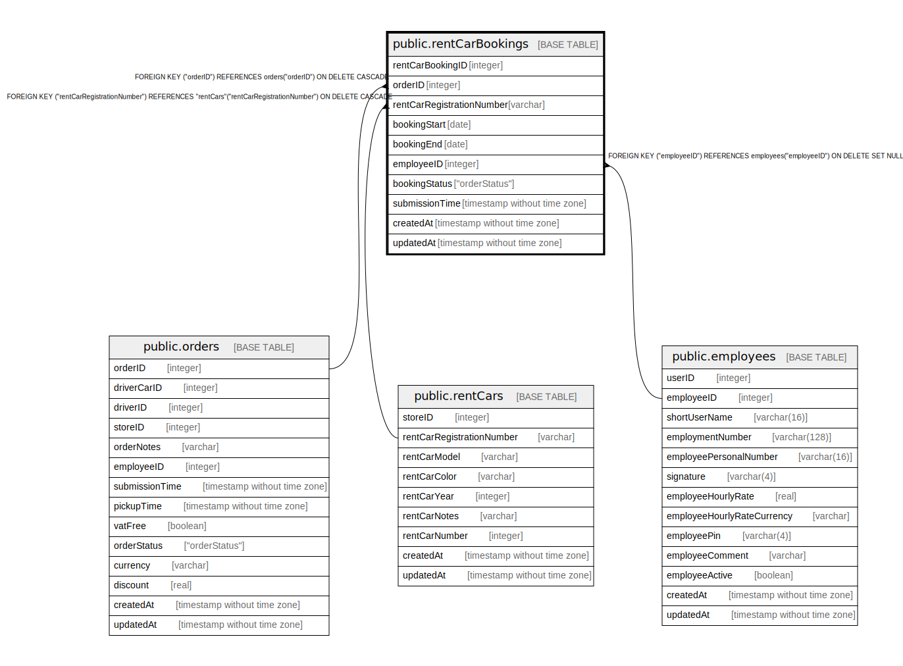

# public.rentCarBookings

## Description

## Columns

| Name | Type | Default | Nullable | Children | Parents | Comment |
| ---- | ---- | ------- | -------- | -------- | ------- | ------- |
| rentCarBookingID | integer | nextval('"rentCarBookings_rentCarBookingID_seq"'::regclass) | false |  |  |  |
| orderID | integer |  | false |  | [public.orders](public.orders.md) |  |
| rentCarRegistrationNumber | varchar |  | false |  | [public.rentCars](public.rentCars.md) |  |
| bookingStart | date |  | false |  |  |  |
| bookingEnd | date |  | false |  |  |  |
| employeeID | integer |  | true |  | [public.employees](public.employees.md) |  |
| bookingStatus | "orderStatus" |  | false |  |  |  |
| submissionTime | timestamp without time zone |  | false |  |  |  |
| createdAt | timestamp without time zone | now() | false |  |  |  |
| updatedAt | timestamp without time zone | now() | false |  |  |  |

## Constraints

| Name | Type | Definition |
| ---- | ---- | ---------- |
| rentCarBookings_employeeID_employees_employeeID_fk | FOREIGN KEY | FOREIGN KEY ("employeeID") REFERENCES employees("employeeID") ON DELETE SET NULL |
| rentCarBookings_orderID_orders_orderID_fk | FOREIGN KEY | FOREIGN KEY ("orderID") REFERENCES orders("orderID") ON DELETE CASCADE |
| rentCarBookings_pkey | PRIMARY KEY | PRIMARY KEY ("rentCarBookingID") |
| rentCarBookings_orderID_unique | UNIQUE | UNIQUE ("orderID") |
| rentCarBookings_rentCarRegistrationNumber_rentCars_rentCarRegis | FOREIGN KEY | FOREIGN KEY ("rentCarRegistrationNumber") REFERENCES "rentCars"("rentCarRegistrationNumber") ON DELETE CASCADE |
| unique_rentCarBookings | UNIQUE | UNIQUE ("rentCarBookingID", "orderID") |

## Indexes

| Name | Definition |
| ---- | ---------- |
| rentCarBookings_pkey | CREATE UNIQUE INDEX "rentCarBookings_pkey" ON public."rentCarBookings" USING btree ("rentCarBookingID") |
| rentCarBookings_orderID_unique | CREATE UNIQUE INDEX "rentCarBookings_orderID_unique" ON public."rentCarBookings" USING btree ("orderID") |
| unique_rentCarBookings | CREATE UNIQUE INDEX "unique_rentCarBookings" ON public."rentCarBookings" USING btree ("rentCarBookingID", "orderID") |

## Relations

---

> Generated by [tbls](https://github.com/k1LoW/tbls)
