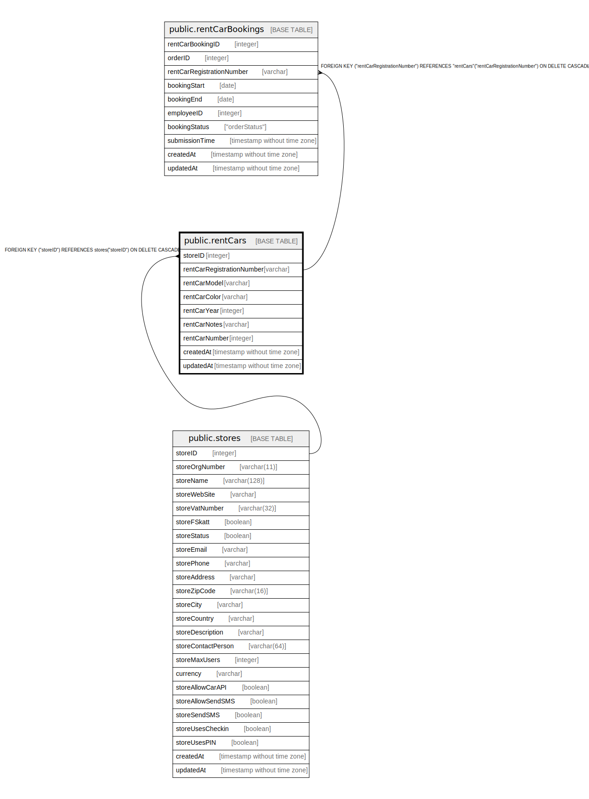

# public.rentCars

## Description

## Columns

| Name | Type | Default | Nullable | Children | Parents | Comment |
| ---- | ---- | ------- | -------- | -------- | ------- | ------- |
| storeID | integer |  | false |  | [public.stores](public.stores.md) |  |
| rentCarRegistrationNumber | varchar |  | false | [public.rentCarBookings](public.rentCarBookings.md) |  |  |
| rentCarModel | varchar |  | false |  |  |  |
| rentCarColor | varchar |  | false |  |  |  |
| rentCarYear | integer |  | false |  |  |  |
| rentCarNotes | varchar |  | true |  |  |  |
| rentCarNumber | integer |  | true |  |  |  |
| createdAt | timestamp without time zone | now() | false |  |  |  |
| updatedAt | timestamp without time zone | now() | false |  |  |  |

## Constraints

| Name | Type | Definition |
| ---- | ---- | ---------- |
| rentCars_pkey | PRIMARY KEY | PRIMARY KEY ("rentCarRegistrationNumber") |
| rentCars_storeID_stores_storeID_fk | FOREIGN KEY | FOREIGN KEY ("storeID") REFERENCES stores("storeID") ON DELETE CASCADE |

## Indexes

| Name | Definition |
| ---- | ---------- |
| rentCars_pkey | CREATE UNIQUE INDEX "rentCars_pkey" ON public."rentCars" USING btree ("rentCarRegistrationNumber") |

## Relations

---

> Generated by [tbls](https://github.com/k1LoW/tbls)
