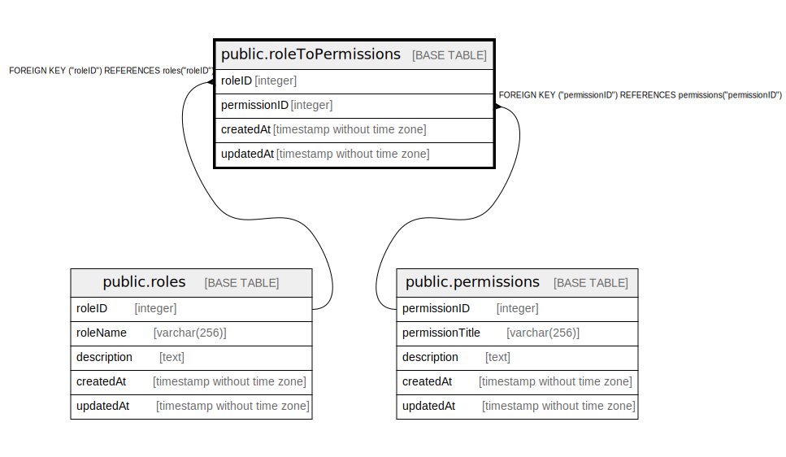

# public.roleToPermissions

## Description

## Columns

| Name | Type | Default | Nullable | Children | Parents | Comment |
| ---- | ---- | ------- | -------- | -------- | ------- | ------- |
| roleID | integer |  | false |  | [public.roles](public.roles.md) |  |
| permissionID | integer |  | false |  | [public.permissions](public.permissions.md) |  |
| createdAt | timestamp without time zone | now() | false |  |  |  |
| updatedAt | timestamp without time zone | now() | false |  |  |  |

## Constraints

| Name | Type | Definition |
| ---- | ---- | ---------- |
| roleToPermissions_permissionID_permissions_permissionID_fk | FOREIGN KEY | FOREIGN KEY ("permissionID") REFERENCES permissions("permissionID") |
| roleToPermissionID | PRIMARY KEY | PRIMARY KEY ("roleID", "permissionID") |
| roleToPermissions_roleID_roles_roleID_fk | FOREIGN KEY | FOREIGN KEY ("roleID") REFERENCES roles("roleID") |

## Indexes

| Name | Definition |
| ---- | ---------- |
| roleToPermissionID | CREATE UNIQUE INDEX "roleToPermissionID" ON public."roleToPermissions" USING btree ("roleID", "permissionID") |

## Relations

---

> Generated by [tbls](https://github.com/k1LoW/tbls)
