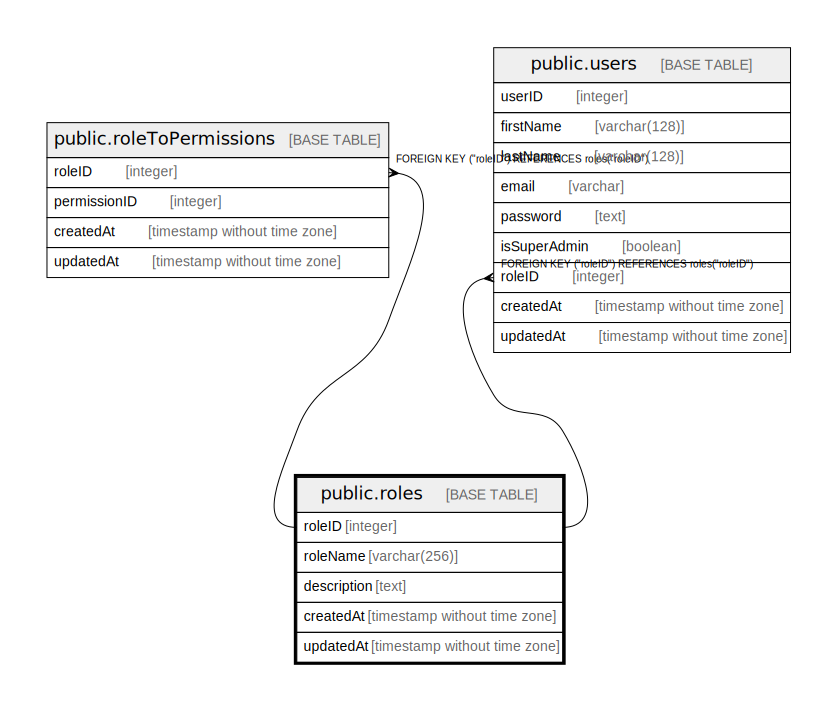

# public.roles

## Description

## Columns

| Name | Type | Default | Nullable | Children | Parents | Comment |
| ---- | ---- | ------- | -------- | -------- | ------- | ------- |
| roleID | integer | nextval('"roles_roleID_seq"'::regclass) | false | [public.roleToPermissions](public.roleToPermissions.md) [public.users](public.users.md) |  |  |
| roleName | varchar(256) |  | false |  |  |  |
| description | text |  | true |  |  |  |
| createdAt | timestamp without time zone | now() | false |  |  |  |
| updatedAt | timestamp without time zone | now() | false |  |  |  |

## Constraints

| Name | Type | Definition |
| ---- | ---- | ---------- |
| roles_pkey | PRIMARY KEY | PRIMARY KEY ("roleID") |
| roles_roleName_unique | UNIQUE | UNIQUE ("roleName") |

## Indexes

| Name | Definition |
| ---- | ---------- |
| roles_pkey | CREATE UNIQUE INDEX roles_pkey ON public.roles USING btree ("roleID") |
| roles_roleName_unique | CREATE UNIQUE INDEX "roles_roleName_unique" ON public.roles USING btree ("roleName") |

## Relations

---

> Generated by [tbls](https://github.com/k1LoW/tbls)
