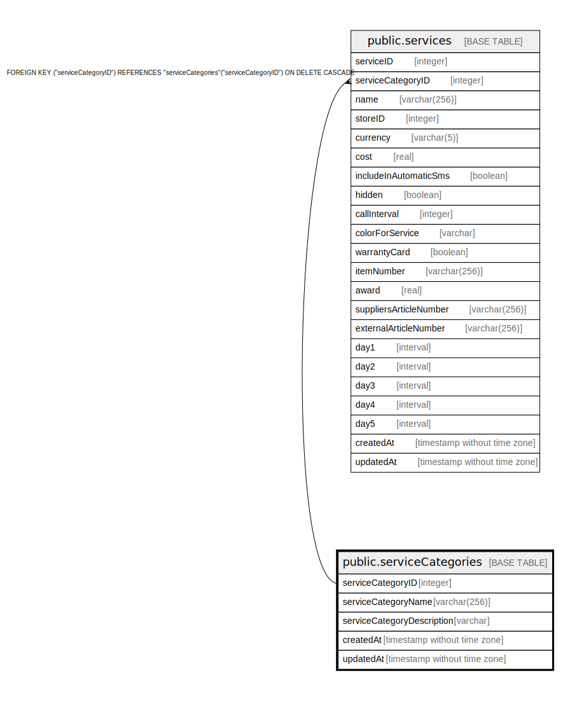

# public.serviceCategories

## Description

## Columns

| Name | Type | Default | Nullable | Children | Parents | Comment |
| ---- | ---- | ------- | -------- | -------- | ------- | ------- |
| serviceCategoryID | integer | nextval('"serviceCategories_serviceCategoryID_seq"'::regclass) | false | [public.localServices](public.localServices.md) [public.services](public.services.md) |  |  |
| serviceCategoryName | varchar(256) |  | false |  |  |  |
| serviceCategoryDescription | varchar |  | true |  |  |  |
| createdAt | timestamp without time zone | now() | false |  |  |  |
| updatedAt | timestamp without time zone | now() | false |  |  |  |

## Constraints

| Name | Type | Definition |
| ---- | ---- | ---------- |
| serviceCategories_pkey | PRIMARY KEY | PRIMARY KEY ("serviceCategoryID") |
| serviceCategories_serviceCategoryName_unique | UNIQUE | UNIQUE ("serviceCategoryName") |

## Indexes

| Name | Definition |
| ---- | ---------- |
| serviceCategories_pkey | CREATE UNIQUE INDEX "serviceCategories_pkey" ON public."serviceCategories" USING btree ("serviceCategoryID") |
| serviceCategories_serviceCategoryName_unique | CREATE UNIQUE INDEX "serviceCategories_serviceCategoryName_unique" ON public."serviceCategories" USING btree ("serviceCategoryName") |

## Relations

---

> Generated by [tbls](https://github.com/k1LoW/tbls)
