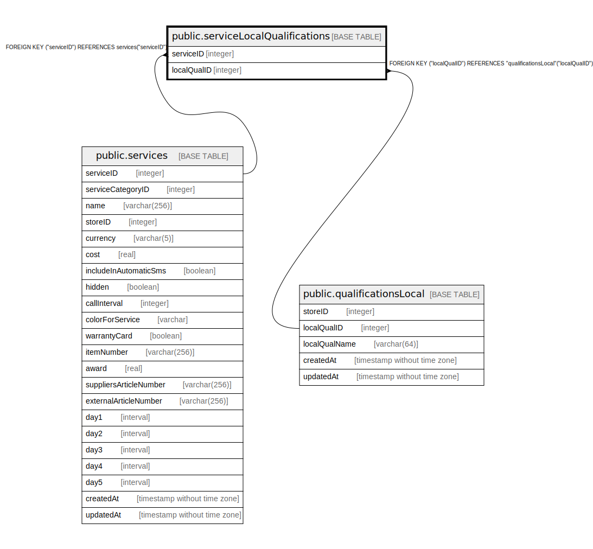

# public.serviceLocalQualifications

## Description

## Columns

| Name | Type | Default | Nullable | Children | Parents | Comment |
| ---- | ---- | ------- | -------- | -------- | ------- | ------- |
| serviceID | integer |  | false |  | [public.services](public.services.md) |  |
| localQualID | integer |  | false |  | [public.qualificationsLocal](public.qualificationsLocal.md) |  |

## Constraints

| Name | Type | Definition |
| ---- | ---- | ---------- |
| serviceLocalQualifications_localQualID_qualificationsLocal_loca | FOREIGN KEY | FOREIGN KEY ("localQualID") REFERENCES "qualificationsLocal"("localQualID") |
| serviceLocalQualifications_localQualID_serviceID_pk | PRIMARY KEY | PRIMARY KEY ("localQualID", "serviceID") |
| serviceLocalQualifications_serviceID_services_serviceID_fk | FOREIGN KEY | FOREIGN KEY ("serviceID") REFERENCES services("serviceID") |

## Indexes

| Name | Definition |
| ---- | ---------- |
| serviceLocalQualifications_localQualID_serviceID_pk | CREATE UNIQUE INDEX "serviceLocalQualifications_localQualID_serviceID_pk" ON public."serviceLocalQualifications" USING btree ("localQualID", "serviceID") |

## Relations

---

> Generated by [tbls](https://github.com/k1LoW/tbls)
