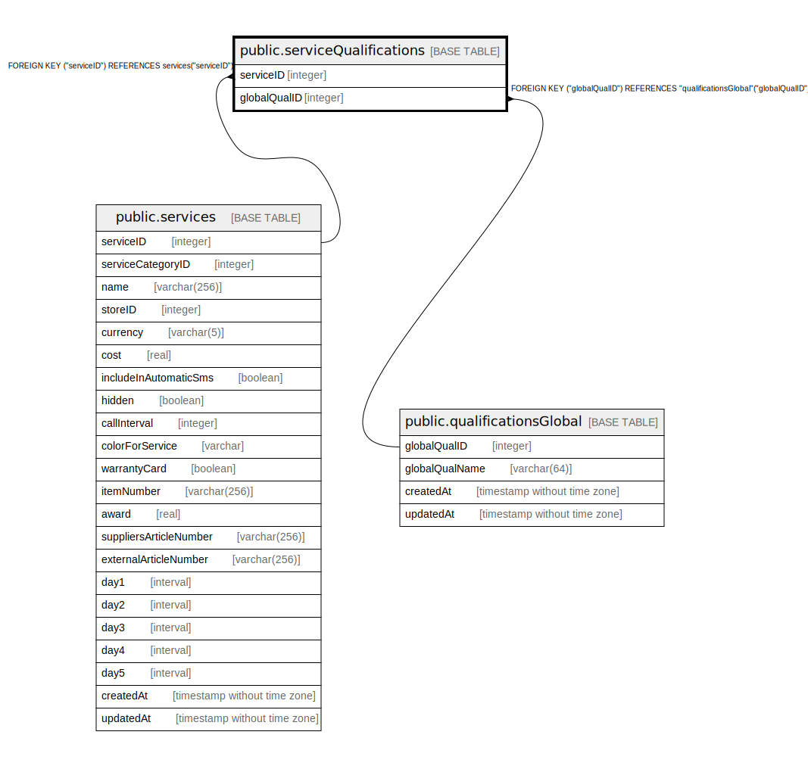

# public.serviceQualifications

## Description

## Columns

| Name | Type | Default | Nullable | Children | Parents | Comment |
| ---- | ---- | ------- | -------- | -------- | ------- | ------- |
| serviceID | integer |  | false |  | [public.services](public.services.md) |  |
| globalQualID | integer |  | false |  | [public.qualificationsGlobal](public.qualificationsGlobal.md) |  |

## Constraints

| Name | Type | Definition |
| ---- | ---- | ---------- |
| serviceQualifications_globalQualID_qualificationsGlobal_globalQ | FOREIGN KEY | FOREIGN KEY ("globalQualID") REFERENCES "qualificationsGlobal"("globalQualID") |
| serviceQualifications_globalQualID_serviceID_pk | PRIMARY KEY | PRIMARY KEY ("globalQualID", "serviceID") |
| serviceQualifications_serviceID_services_serviceID_fk | FOREIGN KEY | FOREIGN KEY ("serviceID") REFERENCES services("serviceID") |

## Indexes

| Name | Definition |
| ---- | ---------- |
| serviceQualifications_globalQualID_serviceID_pk | CREATE UNIQUE INDEX "serviceQualifications_globalQualID_serviceID_pk" ON public."serviceQualifications" USING btree ("globalQualID", "serviceID") |

## Relations

---

> Generated by [tbls](https://github.com/k1LoW/tbls)
