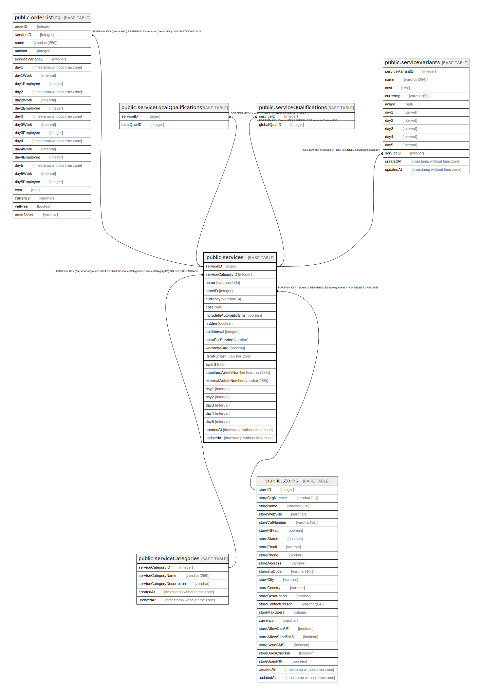

# public.services

## Description

## Columns

| Name | Type | Default | Nullable | Children | Parents | Comment |
| ---- | ---- | ------- | -------- | -------- | ------- | ------- |
| serviceID | integer | nextval('"services_serviceID_seq"'::regclass) | false | [public.orderServices](public.orderServices.md) [public.serviceLocalQualifications](public.serviceLocalQualifications.md) [public.serviceQualifications](public.serviceQualifications.md) [public.serviceVariants](public.serviceVariants.md) |  |  |
| name | varchar(256) |  | false |  |  |  |
| serviceCategoryID | integer |  | false |  | [public.serviceCategories](public.serviceCategories.md) |  |
| currency | varchar(5) |  | false |  |  |  |
| cost | real |  | false |  |  |  |
| includeInAutomaticSms | boolean |  | false |  |  |  |
| hidden | boolean |  | false |  |  |  |
| callInterval | integer |  | true |  |  |  |
| colorForService | varchar |  | false |  |  |  |
| warrantyCard | boolean |  | true |  |  |  |
| itemNumber | varchar(256) |  | true |  |  |  |
| award | real |  | false |  |  |  |
| suppliersArticleNumber | varchar(256) |  | true |  |  |  |
| externalArticleNumber | varchar(256) |  | true |  |  |  |
| day1 | interval |  | true |  |  |  |
| day2 | interval |  | true |  |  |  |
| day3 | interval |  | true |  |  |  |
| day4 | interval |  | true |  |  |  |
| day5 | interval |  | true |  |  |  |
| createdAt | timestamp without time zone | now() | false |  |  |  |
| updatedAt | timestamp without time zone | now() | false |  |  |  |

## Constraints

| Name | Type | Definition |
| ---- | ---- | ---------- |
| services_serviceCategoryID_serviceCategories_serviceCategoryID_ | FOREIGN KEY | FOREIGN KEY ("serviceCategoryID") REFERENCES "serviceCategories"("serviceCategoryID") ON DELETE CASCADE |
| services_pkey | PRIMARY KEY | PRIMARY KEY ("serviceID") |
| services_name_unique | UNIQUE | UNIQUE (name) |
| services_itemNumber_unique | UNIQUE | UNIQUE ("itemNumber") |

## Indexes

| Name | Definition |
| ---- | ---------- |
| services_pkey | CREATE UNIQUE INDEX services_pkey ON public.services USING btree ("serviceID") |
| services_name_unique | CREATE UNIQUE INDEX services_name_unique ON public.services USING btree (name) |
| services_itemNumber_unique | CREATE UNIQUE INDEX "services_itemNumber_unique" ON public.services USING btree ("itemNumber") |

## Relations

---

> Generated by [tbls](https://github.com/k1LoW/tbls)
