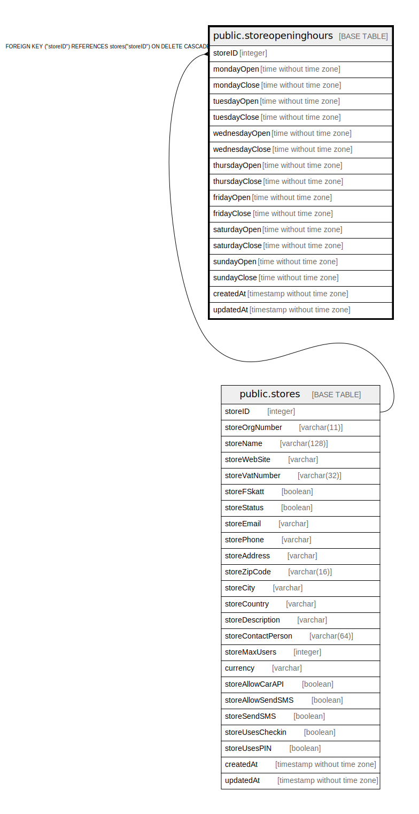

# public.storeopeninghours

## Description

## Columns

| Name | Type | Default | Nullable | Children | Parents | Comment |
| ---- | ---- | ------- | -------- | -------- | ------- | ------- |
| storeID | integer |  | false |  | [public.stores](public.stores.md) |  |
| mondayOpen | time without time zone |  | true |  |  |  |
| mondayClose | time without time zone |  | true |  |  |  |
| tuesdayOpen | time without time zone |  | true |  |  |  |
| tuesdayClose | time without time zone |  | true |  |  |  |
| wednesdayOpen | time without time zone |  | true |  |  |  |
| wednesdayClose | time without time zone |  | true |  |  |  |
| thursdayOpen | time without time zone |  | true |  |  |  |
| thursdayClose | time without time zone |  | true |  |  |  |
| fridayOpen | time without time zone |  | true |  |  |  |
| fridayClose | time without time zone |  | true |  |  |  |
| saturdayOpen | time without time zone |  | true |  |  |  |
| saturdayClose | time without time zone |  | true |  |  |  |
| sundayOpen | time without time zone |  | true |  |  |  |
| sundayClose | time without time zone |  | true |  |  |  |
| createdAt | timestamp without time zone | now() | false |  |  |  |
| updatedAt | timestamp without time zone | now() | false |  |  |  |

## Constraints

| Name | Type | Definition |
| ---- | ---- | ---------- |
| storeopeninghours_pkey | PRIMARY KEY | PRIMARY KEY ("storeID") |
| storeopeninghours_storeID_stores_storeID_fk | FOREIGN KEY | FOREIGN KEY ("storeID") REFERENCES stores("storeID") ON DELETE CASCADE |

## Indexes

| Name | Definition |
| ---- | ---------- |
| storeopeninghours_pkey | CREATE UNIQUE INDEX storeopeninghours_pkey ON public.storeopeninghours USING btree ("storeID") |

## Relations

---

> Generated by [tbls](https://github.com/k1LoW/tbls)
