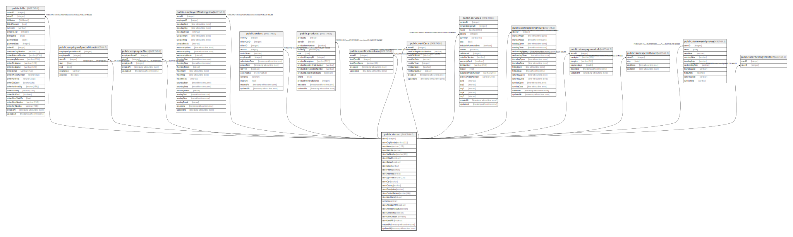

# public.stores

## Description

## Columns

| Name | Type | Default | Nullable | Children | Parents | Comment |
| ---- | ---- | ------- | -------- | -------- | ------- | ------- |
| storeID | integer | nextval('"stores_storeID_seq"'::regclass) | false | [public.employeeSpecialHours](public.employeeSpecialHours.md) [public.employeeStore](public.employeeStore.md) [public.employeeWorkingHours](public.employeeWorkingHours.md) [public.localProducts](public.localProducts.md) [public.localServices](public.localServices.md) [public.orders](public.orders.md) [public.qualificationsLocal](public.qualificationsLocal.md) [public.rentCars](public.rentCars.md) [public.storeopeninghours](public.storeopeninghours.md) [public.storepaymentinfo](public.storepaymentinfo.md) [public.storespecialhours](public.storespecialhours.md) [public.storeweeklynotes](public.storeweeklynotes.md) [public.userBelongsToStore](public.userBelongsToStore.md) |  |  |
| storeOrgNumber | varchar(11) |  | false |  |  |  |
| storeName | varchar(128) |  | false |  |  |  |
| storeWebSite | varchar |  | true |  |  |  |
| storeVatNumber | varchar(32) |  | true |  |  |  |
| storeFSkatt | boolean |  | false |  |  |  |
| storeStatus | boolean |  | false |  |  |  |
| storeEmail | varchar |  | false |  |  |  |
| storePhone | varchar |  | false |  |  |  |
| storeAddress | varchar |  | false |  |  |  |
| storeZipCode | varchar(16) |  | false |  |  |  |
| storeCity | varchar |  | false |  |  |  |
| storeCountry | varchar |  | false |  |  |  |
| storeDescription | varchar |  | true |  |  |  |
| storeContactPerson | varchar(64) |  | true |  |  |  |
| storeMaxUsers | integer |  | true |  |  |  |
| currency | varchar | 'SEK'::character varying | true |  |  |  |
| storeAllowCarAPI | boolean | true | true |  |  |  |
| storeAllowSendSMS | boolean | true | true |  |  |  |
| storeSendSMS | boolean | true | true |  |  |  |
| storeUsesCheckin | boolean | true | true |  |  |  |
| storeUsesPIN | boolean | true | true |  |  |  |
| createdAt | timestamp without time zone | now() | false |  |  |  |
| updatedAt | timestamp without time zone | now() | false |  |  |  |

## Constraints

| Name | Type | Definition |
| ---- | ---- | ---------- |
| stores_pkey | PRIMARY KEY | PRIMARY KEY ("storeID") |
| stores_storeOrgNumber_unique | UNIQUE | UNIQUE ("storeOrgNumber") |
| stores_storeName_unique | UNIQUE | UNIQUE ("storeName") |
| stores_storeAddress_unique | UNIQUE | UNIQUE ("storeAddress") |

## Indexes

| Name | Definition |
| ---- | ---------- |
| stores_pkey | CREATE UNIQUE INDEX stores_pkey ON public.stores USING btree ("storeID") |
| stores_storeOrgNumber_unique | CREATE UNIQUE INDEX "stores_storeOrgNumber_unique" ON public.stores USING btree ("storeOrgNumber") |
| stores_storeName_unique | CREATE UNIQUE INDEX "stores_storeName_unique" ON public.stores USING btree ("storeName") |
| stores_storeAddress_unique | CREATE UNIQUE INDEX "stores_storeAddress_unique" ON public.stores USING btree ("storeAddress") |

## Relations

---

> Generated by [tbls](https://github.com/k1LoW/tbls)
