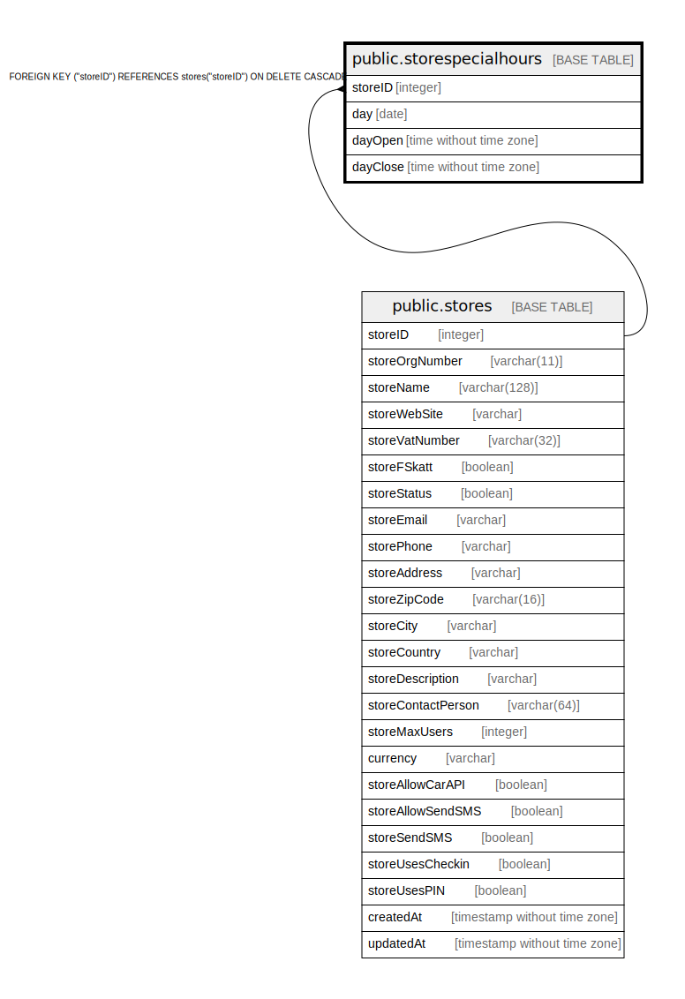

# public.storespecialhours

## Description

## Columns

| Name | Type | Default | Nullable | Children | Parents | Comment |
| ---- | ---- | ------- | -------- | -------- | ------- | ------- |
| storeID | integer |  | false |  | [public.stores](public.stores.md) |  |
| day | date |  | false |  |  |  |
| dayOpen | time without time zone |  | false |  |  |  |
| dayClose | time without time zone |  | false |  |  |  |

## Constraints

| Name | Type | Definition |
| ---- | ---- | ---------- |
| storespecialhours_storeID_stores_storeID_fk | FOREIGN KEY | FOREIGN KEY ("storeID") REFERENCES stores("storeID") ON DELETE CASCADE |
| storespecialhours_storeID_day_pk | PRIMARY KEY | PRIMARY KEY ("storeID", day) |

## Indexes

| Name | Definition |
| ---- | ---------- |
| storespecialhours_storeID_day_pk | CREATE UNIQUE INDEX "storespecialhours_storeID_day_pk" ON public.storespecialhours USING btree ("storeID", day) |
| storeid_idx | CREATE INDEX storeid_idx ON public.storespecialhours USING btree ("storeID") |
| day_idx | CREATE INDEX day_idx ON public.storespecialhours USING btree (day) |

## Relations

---

> Generated by [tbls](https://github.com/k1LoW/tbls)
