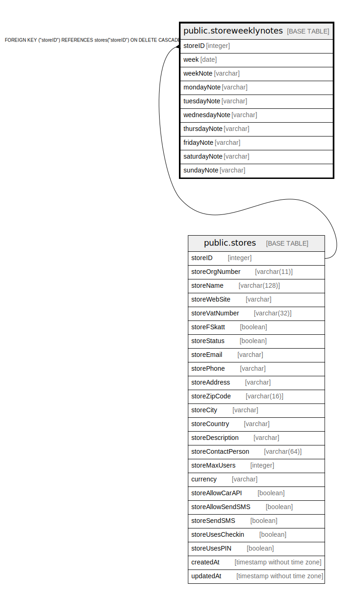

# public.storeweeklynotes

## Description

## Columns

| Name | Type | Default | Nullable | Children | Parents | Comment |
| ---- | ---- | ------- | -------- | -------- | ------- | ------- |
| storeID | integer |  | false |  | [public.stores](public.stores.md) |  |
| week | date |  | false |  |  |  |
| weekNote | varchar |  | true |  |  |  |
| mondayNote | varchar |  | true |  |  |  |
| tuesdayNote | varchar |  | true |  |  |  |
| wednesdayNote | varchar |  | true |  |  |  |
| thursdayNote | varchar |  | true |  |  |  |
| fridayNote | varchar |  | true |  |  |  |
| saturdayNote | varchar |  | true |  |  |  |
| sundayNote | varchar |  | true |  |  |  |

## Constraints

| Name | Type | Definition |
| ---- | ---- | ---------- |
| storeweeklynotes_storeID_stores_storeID_fk | FOREIGN KEY | FOREIGN KEY ("storeID") REFERENCES stores("storeID") ON DELETE CASCADE |
| storeweeklynotes_storeID_week_pk | PRIMARY KEY | PRIMARY KEY ("storeID", week) |

## Indexes

| Name | Definition |
| ---- | ---------- |
| storeweeklynotes_storeID_week_pk | CREATE UNIQUE INDEX "storeweeklynotes_storeID_week_pk" ON public.storeweeklynotes USING btree ("storeID", week) |

## Relations

---

> Generated by [tbls](https://github.com/k1LoW/tbls)
