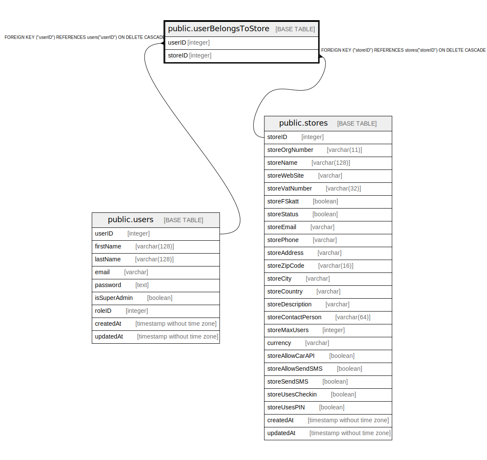

# public.userBelongsToStore

## Description

## Columns

| Name | Type | Default | Nullable | Children | Parents | Comment |
| ---- | ---- | ------- | -------- | -------- | ------- | ------- |
| userID | integer |  | false |  | [public.users](public.users.md) |  |
| storeID | integer |  | false |  | [public.stores](public.stores.md) |  |

## Constraints

| Name | Type | Definition |
| ---- | ---- | ---------- |
| userBelongsToStore_storeID_stores_storeID_fk | FOREIGN KEY | FOREIGN KEY ("storeID") REFERENCES stores("storeID") ON DELETE CASCADE |
| userBelongsToStore_storeID_userID_pk | PRIMARY KEY | PRIMARY KEY ("storeID", "userID") |
| userBelongsToStore_userID_users_userID_fk | FOREIGN KEY | FOREIGN KEY ("userID") REFERENCES users("userID") ON DELETE CASCADE |

## Indexes

| Name | Definition |
| ---- | ---------- |
| userBelongsToStore_storeID_userID_pk | CREATE UNIQUE INDEX "userBelongsToStore_storeID_userID_pk" ON public."userBelongsToStore" USING btree ("storeID", "userID") |

## Relations

---

> Generated by [tbls](https://github.com/k1LoW/tbls)
