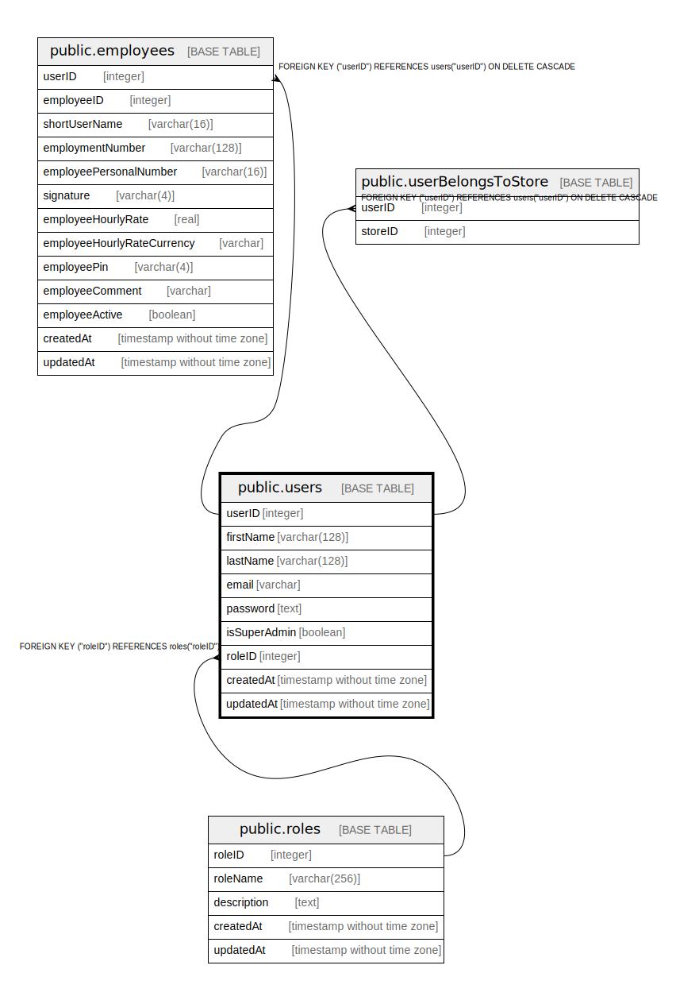

# public.users

## Description

## Columns

| Name | Type | Default | Nullable | Children | Parents | Comment |
| ---- | ---- | ------- | -------- | -------- | ------- | ------- |
| userID | integer | nextval('"users_userID_seq"'::regclass) | false | [public.employees](public.employees.md) [public.userBelongsToStore](public.userBelongsToStore.md) |  |  |
| firstName | varchar(128) |  | false |  |  |  |
| lastName | varchar(128) |  | false |  |  |  |
| email | varchar |  | false |  |  |  |
| password | text |  | false |  |  |  |
| isSuperAdmin | boolean | false | false |  |  |  |
| roleID | integer |  | false |  | [public.roles](public.roles.md) |  |
| createdAt | timestamp without time zone | now() | false |  |  |  |
| updatedAt | timestamp without time zone | now() | false |  |  |  |

## Constraints

| Name | Type | Definition |
| ---- | ---- | ---------- |
| users_roleID_roles_roleID_fk | FOREIGN KEY | FOREIGN KEY ("roleID") REFERENCES roles("roleID") |
| users_pkey | PRIMARY KEY | PRIMARY KEY ("userID") |
| users_email_unique | UNIQUE | UNIQUE (email) |

## Indexes

| Name | Definition |
| ---- | ---------- |
| users_pkey | CREATE UNIQUE INDEX users_pkey ON public.users USING btree ("userID") |
| users_email_unique | CREATE UNIQUE INDEX users_email_unique ON public.users USING btree (email) |

## Relations

---

> Generated by [tbls](https://github.com/k1LoW/tbls)
